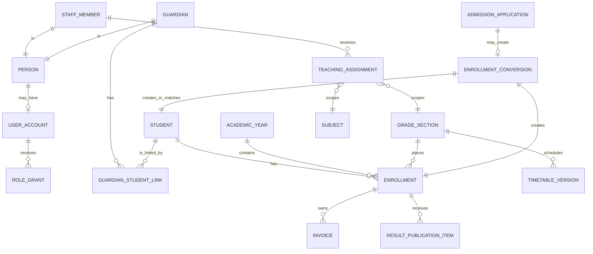

# Feature Integration and Relationship Specification

Version: 1.3
Date: 6 September 2026
Status: Approved target contract; the current Supabase cutover delta is recorded in `PROJECT-STATUS.md`.

> **V15 design system (supersedes V14, 8 September 2026):** The canonical UI design prototype is `V15 Faiz Aam School Platform.html` (repository root; V14 remains as the historical reference). All UI components, layout patterns, design tokens, and screen compositions must follow the V15 specifications in `design/UX-BLUEPRINT.md` (§2 tokens, §12.1 components, §16 responsive, §17 screen catalog, §18–20 role matrix/nav/implementation). Feature integration and relationship behavior is unchanged — only the visual presentation layer adopts V15. Copy V15 layout only, never its illustrative data, counts, actor names, or client-only authorization behavior.

This is the detailed product contract for how Faiz Aam School users, records, features, and UI states connect. It expands `PROJECT-BLUEPRINT.md`; it never overrides the blueprint. Every agent must read this file before changing a core feature, portal context, service contract, data model, or staff workflow.

The purpose is simple: the platform must feel like one school service, not a collection of unrelated screens. A change made in the owning module must appear everywhere that is allowed to consume it, without duplicating business rules or exposing another person’s data.

---

## 1. Scope and interpretation

This specification covers:

- public content and notices;
- identity, sessions, roles, and invitations;
- student admissions and enrollment conversion;
- job vacancies and job applications;
- students, guardians, staff, teachers, and their relationships;
- fee schedules, invoices, payments, receipts, refunds, and reconciliation;
- results, moderation, publication, and correction;
- class timetables, exam date sheets, and overrides;
- documents, notifications, support, settings, and audit;
- the shared UI context and synchronization rules connecting those modules.

“Must” is required for launch. “May” is optional. “Deferred” is outside the first-release commitment. `PROJECT-STATUS.md` records whether a required contract is implemented and verified.

The optional campus-environment demonstrator is isolated. It must not create dependencies on student, guardian, staff, finance, admissions, results, or timetable records unless the project scope is explicitly expanded.

## 2. Code-audit baseline

### Current implementation checkpoint — 24 August 2026

- Supabase migrations `000001–000015` are the committed remote foundation; local migrations `000016–000030` implement the complete application cutover, role/capability hardening, identity/context lifecycle, authoritative admissions/careers/enrollment/uploads, result report releases, timetable revisions, operational workflows, and provider-job integrity.
- The scratch PostgreSQL 17 validator passes all migrations and the RLS, RPC, result-release, timetable, operational, and provider-job suites from zero.
- Supabase Auth SSR, AAL/TOTP, server route guards/loaders, private Storage/PDF/scanner boundaries, official Svix verification, Resend/outbox adapters, cron, health, and per-account projections are implemented locally and covered with fakes. They still require staging credentials and real-provider evidence.
- The staff/system-administrator role boundary is hardened locally: system administration does not substitute for functional business grants, pure teachers cannot read finance, and maker/checker/self-approval denials are covered by local tests.
- The runtime remains `FASS_DATA_ADAPTER=demo`; the static cutover guard is green, but staging must set both adapter variables together and prove real sessions before the runtime changes globally.
- Staging/global Supabase and provider verification is pending. Storage, Resend, payment selection, Vercel, restore, and production remain external gates; this file is not evidence that they are live.

The 5 August 2026 audit found a strong, broad frontend with passing quality gates,
but not yet a unified production data model. The baseline below remains the
normative product contract; current implementation state is the checkpoint above
and the evidence matrix in `PROJECT-STATUS.md`. Shared context, service
boundaries, admission→fee→enrollment demo behavior, role-boundary hardening,
workflow repairs, event propagation, and contract tests are retained locally,
while the remaining Supabase facade gaps are explicitly listed below.

| Area | What the current UI proves | What is not yet integrated |
|---|---|---|
| Identity | Demo guardian sign-in, verification, recovery, session (stable account/person/guardian ids, expired-session sign-out), and pending link request through typed services | Server route guards/AAL claims, staff invitation acceptance UI, and C2.1 context projections are local; staging session proof and remaining link projection remain |
| Portal context | Shared family-context provider drives the shell and every child-scoped page; two linked children switch together; unlinked children are denied | Server-resolved family context and revocation revalidation are partial; active-child persistence and wrong-child resource handling must be completed in C2.1 |
| Admissions | Draft, submit, status, requested-change edit, staff decisions, offer response, and the admission-fee invoice handoff | C2.2 local Supabase facade maps owned/staff rows, server drafts, immutable versions, decisions, offers, and readiness; staging session proof remains |
| Admission fee | Accepted offers issue one invoice through `financeService`; the shared checkout posts once with a receipt; readiness gates enrollment conversion | Real gateway adapters, waiver/refund rules, and conversion committed as one transaction (demo commits all changes together) |
| Careers | Draft, submit, status, withdrawal, and staff decisions through one demo service | C2.4 local facade adds server drafts/withdrawal, version-safe HR decisions, reviewer assignment/scorecard/interview commands; private Storage files and staging proof remain |
| Family finance | Ledgers keyed by student; portal fees/receipts/overview read the service for the active child; staff finance reads the same service with parity | Officer/approver maker-checker boundary for adjustments/refunds; wrong-child resource handling |
| Results | Per-student published snapshots on the portal; staff entry/moderation/approval/publication/correction with versioning | C2.3 local facade maps canonical batches, marks, versions, publications, corrections, and snapshots; reviewer/publisher and immutable-publication checks remain to prove in staging |
| Timetable | One `timetableService` facade serves portal and staff; class derives from the active enrollment | C2.3 local async facade maps effective/draft versions, hard conflicts, supersession, overrides, and exam date sheets; staging proof remains |
| Notices/content | One `contentService` owns status/audience/version; public/portal/publisher read the same record | C2.4 local immutable content draft/review/publish/unpublish commands and public/family/staff projection; scheduled/provider delivery remains |
| Documents | `documentsService` returns per-student metadata bundles; preview/missing/denied states | Private Storage routes and generated PDF upload plumbing exist locally; scan/finalisation, signed delivery policy, retention workflow, and complete document projection remain |
| Support | Public/portal submission and staff response share one demo thread | C2.4 local requester-safe/staff-private projections, public intake/rate limit, reopen/assign commands; SLA/provider notification remains |
| Users/settings/audit | Typed demo adapters drive the staff pages; settings read service values | C2.4 settings optimistic save, PostgreSQL read-only audit projection, and per-account notification list/mark branches; staging identity/email proof remains |

These differences are the remaining implementation and Supabase-cutover gaps,
not a new UI backlog. A passing visual or demo-flow test must not be used as
evidence that the corresponding server, relationship, authorization, or
cross-module contract exists.

## 3. Canonical identity and relationship model

### 3.1 Identity concepts

Keep these concepts separate:

- **Person**: a human represented by minimum school-held identity data.
- **User account**: credentials/session identity used to sign in. A person may have zero or one active account in the first release.
- **Role grant**: what an account may do, such as guardian, finance officer, result entry officer, or result publisher.
- **Scope assignment**: which records that role may act on, such as Class 8-A Mathematics, the admissions queue, or one job panel.
- **Guardian**: a person with one or more student relationships. Being a guardian is not the same as owning every student record with the same phone number.
- **Student**: the permanent school record created only through approved enrollment/import. Students are records, never accounts; they never sign in.
- **Staff member**: an employed/authorised school person. Teacher is a staff responsibility plus non-login teaching assignments, NOT an account: a teacher holds no user account and no role grant.
- **Applicant identity**: a limited account or verified contact that owns student or job applications before any permanent student/staff record exists.

One account may legitimately have several roles (for example, a staff member may also be a guardian). Portal profiles are provisioning presets: a profile account exposes its `profileCode` (administrator or principal) plus all active granular roles, and the server always evaluates those grants. The UI must keep family and staff data in separate, explicitly switched contexts; it must never merge staff and family data into one unscoped page.

### 3.2 Canonical relationship graph



`TEACHING_ASSIGNMENT` (staff member, academic year, section, subject) is independent of role grants: it attributes teaching responsibility for timetables and conflicts without any teacher account existing.

### 3.3 Relationship cardinality and lifecycle

| Relationship | Cardinality | Required lifecycle |
|---|---|---|
| Person to user account | 1 to 0..1 active account | invited → active → suspended/closed; identities are merged only by authorised review |
| User to roles | 1 to many | requested/granted → active → revoked; every grant records grantor, reason, scope, start/end |
| Guardian to student | many to many | pending verification → active → restricted/ended; never inferred solely from contact match |
| Student to enrollment | 1 to many over time | pending → active → completed/transferred/withdrawn; at most one active enrollment per academic year unless approved policy says otherwise |
| Staff to assignments | 1 to many | scheduled/active → ended; role permits a capability, assignment limits its record scope |
| Admission application to student | 1 to 0..1 conversion | no student exists while draft/reviewing; conversion is idempotent and auditable |
| Job application to staff | 1 to 0..1 later onboarding link | an offer does not create staff access; HR acceptance/onboarding and account invitation are separate actions |

### 3.4 Guardian/student link permissions

Each link must record:

- guardian ID and student ID;
- relationship label recorded by the school;
- status and verification source;
- who approved it and why;
- effective start/end and restriction reason;
- contact priority and emergency-contact flag if school policy requires them;
- portal capabilities: academics, finance, documents, notices, and profile-correction requests.

The first release should normally grant the same family-portal view to each verified guardian, but the data model must support restrictions. Billing contact, emergency contact, and legal relationship are separate facts. A person may be responsible for payment without being allowed to change identity data.

Link activation, restriction, or removal must invalidate affected sessions or force permission revalidation immediately. Historical audit and financial attribution remain; access does not.

### 3.5 Teacher and staff relationships

Teachers need NO user account and NO role grant. A teacher is a non-login school record consisting of:

1. an active staff record;
2. one or more `teaching_assignments` rows with academic year, class/section, subject, and effective dates.

Marks entry is not a teacher function: the Principal profile's `result_entry_officer` role enters/imports marks centrally, and an independent Administrator (exam_reviewer/result_publisher) moderates, approves, and publishes — no account approves its own originating work. Timetable attribution and conflict checks use teaching assignments, never credentials. Employment title alone never gives broad student access.

Admissions, finance, HR, content, support, timetable, exam-review, audit, and system-administration permissions follow the same role-plus-scope principle, provisioned through the two staff access profiles (`administrator`, `principal`). High-risk approval roles must remain distinct from ordinary data-entry roles where maker/checker policy applies: the Principal makes (drafts, reviews, enters, operates) and an independent Administrator approves/publishes/decides; no account approves its own originating work.

## 4. Stable identifiers and context

### 4.1 Internal IDs and public references

Use opaque internal IDs for relations and access checks. Human-readable references such as `APP-2026-0424`, `INV-2026-0103`, or `PUB-2026-002` are display/search references, not authorization credentials.

Every route that contains a reference must resolve it server-side, authorize the current user against the resolved internal record, and return the same safe not-found response for unknown and unauthorized records when disclosure would leak existence.

### 4.2 Family portal context

The portal has one canonical context object:

```ts
type FamilyPortalContext = {
  accountId: string;
  guardianId?: string;
  activeStudentId: string;
  activeEnrollmentId: string;
  academicYearId: string;
  allowedCapabilities: Array<"academics" | "finance" | "documents" | "notices" | "profile">;
  relationshipVersion: number;
};
```

Rules:

- The server supplies the accessible-student list from active links; the browser never invents it.
- With one accessible student, select that student automatically and still show the context clearly.
- With several, restore the last valid selection for that account; otherwise select the first active enrollment and announce it.
- Switching child changes the context for overview, fees, receipts, results, timetable, notices, documents, support metadata, and profile.
- A child switch clears selections that do not belong to the new child: invoice, receipt, term publication, class timetable, document preview, and any unsent form containing the old child reference.
- A dirty form blocks an accidental switch with a save/discard confirmation.
- The URL may carry safe filters such as term or invoice reference, but it must not be the sole holder of student scope.
- Every protected loader rechecks link status and capability. A stale browser selection cannot preserve access after revocation.
- The page header and consequential confirmation always repeat the active student’s name, class/section, and safe reference.

### 4.3 Staff workspace context

Staff context consists of account, active portal profile, active grants, academic year, and optional operational filters. Profile accounts (administrator/principal) expose a `profileCode` plus all active granular roles; the profile routes navigation and landing surfaces while the server continues to evaluate every granular grant, AAL level, and record scope. Granular workspace switching is legacy-only, retained for pre-profile accounts. Filters never expand server scope.

Teacher class/subject choices come only from non-login teaching assignments; teachers never sign in. For central staff, queues default to the current cycle/year but allow authorised historical access.

## 5. Domain ownership and synchronization

### 5.1 One source of truth per fact

| Fact | Owning module | Consumers |
|---|---|---|
| Account, session, role grant | Identity/access | Every protected loader/action |
| Guardian/student relationship | Student records/access | Portal context, finance, results, timetable, documents, notices |
| Application state and submitted versions | Admissions | Applicant status, staff queue, notifications, enrollment conversion |
| Vacancy and job-application state | Careers | Public careers, applicant status, HR queue, notifications |
| Student identity and enrollment placement | Student records | Finance, results, timetable, documents, notices |
| Invoice balance and allocations | Finance ledger | Parent portal, staff finance, receipts, reconciliation |
| Gateway transaction outcome | Payment adapter/event store | Finance ledger only; it is not itself the ledger |
| Published result snapshot/version | Results | Family/student report, documents, notices |
| Effective timetable version/override | Timetable | Family/student view, teacher view, notices |
| Notice body, audience, and version | Content/notices | Public site, portal, notification outbox |
| Document metadata and object key | Documents | Owning module UI through authorized delivery |
| Support thread and internal notes | Support | Requester-safe thread, scoped staff inbox |
| Audit event | Audit | Auditor and authorised module owners |

Consumers may cache or project these records; they must not create a second mutable source.

### 5.2 Synchronous transactional updates

The following must commit in one database transaction:

- enrollment conversion: conversion record, student match/create, enrollment, guardian links, and audit/outbox rows;
- role or relationship grant/revocation plus audit and session-revalidation marker;
- invoice issue/adjustment and ledger/audit entries;
- verified payment posting, allocation, receipt-number reservation, and outbox event;
- result publication version, student publication items, audit, and outbox event;
- timetable publication version, effective assignment set, audit, and outbox event;
- consequential admissions/careers/support decisions plus their visible timeline event.

If any required row fails, none of the transaction is presented as complete.

### 5.3 Eventual updates through the outbox

These may complete after the transaction:

- email/SMS/in-app delivery;
- PDF rendering;
- virus scanning and document derivative creation;
- search projection or reporting aggregates;
- scheduled notice publication delivery;
- non-authoritative analytics.

The UI must show the authoritative record immediately and label secondary work accurately, for example “Payment recorded; receipt PDF is being prepared.” Notification failure never rolls back a successful payment or publication.

### 5.4 UI revalidation contract

After a successful write:

1. render the returned authoritative record;
2. invalidate/reload every affected projection;
3. preserve the active user context;
4. announce the result with a recoverable next action;
5. make retries safe through idempotency keys or version checks.

Required invalidations include:

| Write | Must refresh |
|---|---|
| Child link activated/revoked | portal shell, child selector, all child-scoped pages, sessions |
| Enrollment created/transferred | profile, overview, finance eligibility, result roster, timetable scope, notices |
| Invoice/payment/refund posted | portal overview, fee ledger, invoice, receipts, documents, staff finance, notification count |
| Result published/corrected | portal overview, results list/detail, documents, notifications, staff batch/version history |
| Timetable published/overridden | portal timetable, teacher schedule, notices/notifications when targeted |
| Notice published/expired | public/portal notice lists, home highlights, notification outbox |
| Application/job decision | applicant status, staff queue/detail, notifications |
| Support response | requester thread, staff queue/detail, notifications |

Do not rely on full-page reloads as the only consistency strategy. Server rendering, route revalidation, query invalidation, or a small same-origin event channel may be used, but the service return value and server source remain authoritative.

### 5.5 Concurrency and stale data

Version mutable operational records with an integer or immutable version ID. Writes submit the last-seen version. A conflict returns a typed `409`-style response with safe current state; the UI explains that another user changed the record and offers reload/review, never silent overwrite.

Financial ledger entries, submitted application versions, published results, timetable publications, and audit events are append-only. Corrections add new entries/versions with reason and author.

## 6. Feature contracts

### 6.1 Public site and content

**Owner:** content module.  
**Users:** visitors; content editors/publishers.  
**Inputs:** verified school profile, pages, notices, vacancies, disclosures, policy pages, safe documents.  
**Outputs:** indexed public pages and non-sensitive downloads.

Required behavior:

- Draft → review → scheduled/published → archived/unpublished with version history.
- Publication requires a content publisher where approval is configured.
- Notices have audience, urgency, publish/expiry times, owner, and review date.
- Public pages never query confidential domains or display generated student claims as fact.
- Missing school facts stay explicitly unverified/concept; they are not filled from design copy.
- Broken links, expired notices, and inaccessible downloads are visible to content staff before publication.

UI states: skeleton/loading, no notices, filtered-empty, scheduled, draft, published, expired, file unavailable, and publication conflict.

### 6.2 Identity, authentication, and recovery

**Owner:** identity/access module.  
**Users:** applicants, guardians, students where allowed, staff.

Required behavior:

- Sign-in establishes a secure server session; protected pages deny anonymous access.
- Applicant/guardian verification can use supported OTP or magic-link methods. Codes are never stored in plaintext application tables or logged.
- Staff uses MFA before privileged access.
- Recovery gives the same public response for known and unknown identifiers.
- Session expiry preserves a safe return location but never unsaved secrets or another user’s record reference.
- Role or relationship changes are reflected on the next authorized request and revoke no-longer-valid sessions promptly.
- Rate limits and abuse controls apply to sign-in, verification, recovery, invitations, and link requests.

### 6.3 Guardian/student linking

There are two safe paths:

1. **Enrollment invitation:** enrollment conversion records a guardian relationship and sends a one-time invitation to the verified contact.
2. **Guardian request:** a signed-in guardian supplies a school reference and relationship; staff verifies evidence and approves or rejects it.

State: `pending_verification → active → restricted/ended`, with rejection as a terminal request state. A request reference is not an active link. Duplicate active links collapse safely; conflicting identity evidence goes to human review.

UI requirements:

- link request acknowledgement and reference;
- pending/approved/rejected status and school-safe reason;
- linked-child selector sourced from active links;
- “access changed” state when a relationship is revoked;
- no result/fee/document preview until activation.

### 6.4 Student admissions

**Owner:** admissions until conversion; student records after conversion.

State:

```text
Draft → Submitted → Under review ↔ Changes requested → Assessment
Assessment → Offered | Waitlisted | Declined
Offered → Accepted → Admission-fee pending/waived → Enrollment ready → Enrolled
Eligible non-terminal states → Withdrawn, only under approved policy
```

Rules:

- A submitted application is immutable; requested edits create the next application version.
- Staff-private notes and applicant-visible reasons are separate fields.
- Capacity, window, age/grade rules, duplicate signals, and required documents are server evaluated.
- Offer has grade, year/session, expiry, conditions, and fee requirement.
- Acceptance is idempotent and does not equal enrollment.
- If an admission fee is required, admissions requests an invoice from finance and displays that invoice’s real state.
- Enrollment conversion runs only when all explicit conditions are satisfied. Retrying it returns the same student/enrollment/link result.
- Conversion never loses the original application or documents; it links them with retention controls.

UI connection:

- applicant timeline and staff detail read the same events with visibility filtering;
- staff decision updates the applicant status after revalidation;
- accepted offer links to the exact admission invoice;
- successful fee posting updates readiness;
- enrollment confirmation supplies the permanent student reference and guardian invitation/portal step.

### 6.5 Job vacancies and applications

**Owner:** careers/HR module.

State: `Draft → Submitted → Eligibility review → Shortlisted → Interview/assessment → Reference check when policy requires → Offered | Not selected`, with `Withdrawn` from permitted non-terminal states.

Rules:

- Application belongs to one vacancy version; closing/editing the vacancy cannot rewrite submitted terms.
- Requested documents are vacancy-specific and privately stored.
- Reviewer assignment scopes access; scorecards/internal notes never appear to applicants.
- Applicant-visible events use neutral, approved wording.
- Offer acceptance and staff onboarding are separate. Creating a staff account/assignment requires authorised onboarding and does not happen on the offer click.
- Retention/anonymisation follows the approved HR policy.

### 6.6 Student records and enrollment

**Owner:** student-records module.

The permanent student record stores stable identity and school number. Placement belongs to enrollment, not the student identity row. Promotion, transfer, completion, or withdrawal ends/changes an enrollment and preserves history.

Enrollment is the joining key for first-release operational modules:

- invoices use student + enrollment + academic year;
- result rosters use eligible enrollment at exam scope;
- timetable lookup uses enrollment section and effective date;
- portal notices use enrollment grade/section/year;
- documents attach to student, enrollment, invoice, result publication, or application as appropriate.

Medical/support information, if retained, uses narrower permissions and must not appear in ordinary finance or teacher tables.

### 6.7 Fees, invoices, concessions, and adjustments

**Owner:** finance ledger.

Required invoice identity: student ID, enrollment ID, academic year, fee schedule version, currency, issue/due dates, line items, total, allocations, balance, and public reference.

Rules:

- Fee schedules are versioned configuration. Changing a schedule does not rewrite issued invoices.
- Concessions and adjustments are explicit signed line items with authority/reason.
- Partial payment, late fee, write-off, refund, and overpayment behavior follow approved policy.
- The parent and finance officer see the same computed balance from ledger entries.
- Batch invoice creation is retry-safe per enrollment/schedule/period.
- Staff search/filter never bypasses record permissions or default data minimization.

### 6.8 Payments, receipts, refunds, and reconciliation

**Owner:** finance ledger; gateway adapter supplies external transaction evidence.

Flow:

```text
Create attempt → provider checkout → processing
processing → succeeded | failed | cancelled | delayed/unknown
succeeded + verified event → post ledger once → allocate once → issue receipt once
posted payment → refund requested → approved → provider pending → refund confirmed/failed
```

Rules:

- The browser redirect is never proof of payment.
- Verify signed provider events from the raw request, store event identity, and process idempotently.
- Verify invoice, student, amount, currency, order, merchant, and provider references before posting.
- One confirmed attempt creates at most one payment and one receipt number.
- Unknown/delayed states remain processing and offer safe status refresh, not a second immediate charge.
- Refunds append entries; original payment and receipt remain visible with updated status.
- Reconciliation compares gateway settlement, payment, allocation, refund, and bank state without mutating ledger history.

The admission-fee flow must call this same service. It must not use a separate timer, receipt counter, or payment state machine.

### 6.9 Results and report cards

**Owner:** results module.

Relationships:

- Exam configuration identifies academic year, term/exam, class/section, subjects/components, maxima, grading scheme, and publication rules.
- The roster is derived from eligible enrollments and frozen for the batch version.
- Teacher entry access is derived from active teacher assignments.
- Moderation and publication require separate scoped roles.

State: `Draft → Submitted → Moderation → Returned | Approved → Published`; a correction starts a new draft version from the published snapshot and repeats review/publication.

Rules:

- Missing/absent/result status is explicit; do not infer zero.
- Validate maxima, totals, duplicate student rows, invalid enrollment, and configured grading.
- Publication creates an immutable per-student snapshot. The portal must render marks and metadata from that same snapshot, not a separate term fixture.
- Earlier versions remain auditable; families see the latest valid version and an understandable correction notice.
- Aggregate/percentage, remarks, class rank, attendance, and PDF layout are policy-controlled. Attendance is excluded from the first release unless the blueprint is explicitly expanded.
- Results are never publicly searchable or indexable.

### 6.10 Timetables and exam date sheets

**Owner:** timetable module.

Use one service and one version model for staff and portal. A class timetable, exam date sheet, and date-specific override are separate record types.

Rules:

- Base timetable is effective-dated by academic year and section.
- Validate teacher, room, cohort, subject/assignment, duplicate slot, and period rules before publication.
- Publish creates an immutable version with actor, reason/note, and effective date.
- Overrides record substitute teacher, room, subject, cancellation, or special period without rewriting the base.
- Portal derives its class from active/historical enrollment and date; teacher view derives assignments from staff scope.
- A targeted notification may be produced when a relevant published schedule changes.

### 6.11 Notices and notifications

**Owner:** content for notice truth; notification module for delivery attempts.

Audience can be public, role-based, application-specific, or enrollment-based by academic year/grade/section/student. The audience is resolved server-side at publish/send time with an auditable rule/version.

Notice publication and in-app visibility are authoritative even when email/SMS delivery fails. Delivery retries use the outbox and unique recipient/event/channel keys. Users can mark in-app items read without changing another user’s state.

Never put sensitive student, result, fee, or application details in message subjects, lock-screen previews, or public URLs. Link users to an authenticated record.

### 6.12 Documents and generated PDFs

**Owner:** documents module for storage/delivery; originating domain owns record meaning.

Every document records owner domain/record, category, original safe filename, object key, content type, size, checksum, scan state, visibility, version, retention class, uploader, and timestamps.

Rules:

- Private object storage only; no protected file in `/public`.
- Allowlist type/size/page count, verify actual content, randomize object keys, scan, and quarantine failures.
- Download/preview authorizes the current user against the owning record on every request and uses a short-lived delivery URL or streamed response.
- Generated receipts/report cards point to immutable source versions.
- Missing, processing, quarantined, access-denied, expired, and generation-failed states have distinct UI copy.

### 6.13 Support and grievances

**Owner:** support module.

State: `New → Assigned/In progress → Waiting for requester → Resolved → Reopened`, with closure/retention behavior per policy.

Separate:

- requester-visible submission/response thread;
- staff-private notes and assignment history;
- safe references to related application/invoice/result records.

Support staff see only the minimum related record needed. They cannot relink children, change balances, publish results, or impersonate users. A support resolution does not mutate another domain; it routes the authorised owner to act there.

### 6.14 Users, settings, and audit

Settings are versioned configuration with effective dates where business behavior changes. Examples: academic years, application windows, grades/sections, periods, payment policy flags, result policy, templates, and retention.

User administration grants/revokes roles and assignments; it does not edit business records. Consequential changes require reason and may require a second approver.

Audit events include safe actor, action, target type/reference, outcome, reason, request/correlation ID, and UTC timestamp. Logs must exclude passwords, OTPs, provider secrets, raw document contents, and unnecessary child/contact details.

## 7. UI route and component contract

### 7.1 Shared shells

Public shell: school identity, primary navigation, notices/contact access, footer policies, skip link, and mobile drawer.

Applicant shell: reference/status context, save state, progress, privacy note, safe exit/recovery.

Family portal shell: signed-in role, active child/enrollment, child switcher, year where relevant, notifications, help, security, and sign out.

Staff shell: active staff identity, role/workspace switch, scoped navigation, assignment/year context, notifications, and sign out.

The shell must never display a role or context the session cannot prove.

### 7.2 Required page states

Every data page must define:

- initial loading/skeleton without misleading stale facts;
- success with source/version/status context;
- genuine empty state with a useful next action;
- validation summary plus field errors;
- permission denied/session expired;
- safe not found;
- recoverable service/network failure and retry;
- stale/conflict state;
- processing/pending-external state where relevant;
- partial success, such as record committed but notification/PDF pending;
- irreversible/high-risk confirmation with object, impact, and reason;
- final state with the next operational step.

### 7.3 Context indicators

Every child-scoped page shows the active child. Consequential finance/document actions also show safe student and invoice references. Result and timetable pages show academic year, section, and publication/effective version. Staff detail pages show scope, status, assignee/reviewer, last update, and version.

### 7.4 Component reuse

Reuse shared semantic components for status badges, timelines, validation summaries, confirmation panels, empty/error states, version history, record references, active context, and document state. Domain-specific wording and allowed transitions remain in domain modules, not a generic configurable workflow builder.

## 8. Service and adapter contract

The frontend calls typed domain services. Components do not import mutable fixture arrays as an operational source. Pure presentation types/formatters may live in shared packages, but records come through services.

Each service method must define:

- authenticated actor and required capability;
- record scope and input schema;
- allowed current versions/states;
- transaction and idempotency behavior;
- returned authoritative projection;
- audit and outbox effects;
- typed errors safe for the UI.

Provider adapters exist behind domain services for auth, payments, storage, notifications, and PDF rendering. Provider callbacks call domain services; they do not update UI tables directly.

Recommended error envelope:

```ts
type ServiceError = {
  code: string;
  message: string;
  fieldErrors?: Record<string, string>;
  retryable: boolean;
  currentVersion?: number;
  correlationRef: string;
};
```

## 9. Frontend integration sequence

Do this before selecting or building the full backend:

1. Create shared typed identity/person/student/guardian/staff/enrollment/context contracts.
2. Add one family portal context provider/loader and make the child switcher real against at least two fictional linked students.
3. Parameterize every portal service by `studentId`/`enrollmentId`; remove fixed `demoStudent` reads from operational components.
4. Route all staff and portal finance reads through one finance service.
5. Replace the local admission-fee island with the same finance payment attempt/receipt path and a demo enrollment-ready transition.
6. Make portal result rows come from the published student snapshot returned by the results service.
7. Consolidate `academics` timetable types/stub and `timetable-demo` into one timetable service.
8. Put notices, documents, notifications, settings, users, and audit behind typed services; keep honest demo adapters.
9. Add relationship, cross-context, unauthorized-reference, stale-version, and cross-module journey tests.
10. Only then freeze backend contracts and implement server adapters/database migrations.

## 10. Required integration tests

At minimum:

- guardian A can switch between two linked students; every portal module changes together;
- guardian A cannot fetch guardian B’s child by URL/reference or stale cache;
- revoked link disappears and access ends immediately;
- admission acceptance creates/opens exactly one admission invoice; verified payment makes enrollment ready; conversion creates one student/enrollment/link on retry;
- family and finance staff see identical invoice balance and receipt after payment/refund;
- result_entry_officer (Principal profile) enters/imports marks centrally; an independent Administrator checks/approves/publishes; no account approves its own originating work (the same independent Administrator may moderate AND publish a Principal-originated sheet, actor-level no-self-approval enforced);
- moderator return reason reaches the result entry officer; publisher release reaches only eligible linked families;
- correction publishes a new result version and earlier version remains auditable;
- timetable conflict blocks publication; published version reaches matching enrollment and not another class;
- job reviewer cannot access student/finance records; offer does not create staff access;
- content audience reaches the intended enrollment set without exposing recipients publicly;
- document download denies wrong guardian and expired/revoked link;
- support response is requester-visible while private notes remain staff-only;
- duplicate submits, gateway events, publication requests, and notification sends do not duplicate records;
- all important flows cover validation, denial, retry, stale conflict, and recovery.

## 11. School decisions still required

No implementation may invent these:

- official school identity, affiliation, classes/sections, contacts, languages, and approved media;
- guardian verification evidence, relationship restrictions, student-account age/policy, and account ownership;
- admission windows, eligibility/capacity, withdrawal, offer expiry, fee prerequisite, and enrollment authority;
- fee schedule, concessions, partial/late/refund/write-off rules, gateway and merchant ownership;
- subjects/components/maxima, grade bands, absent/result status, aggregate/remark/PDF rules, moderation and correction authority;
- working days, periods, rooms, teacher assignments, overrides, substitute and exam date-sheet process;
- vacancy approval, scorecards, interview/reference process, applicant visibility, and retention;
- notice approval/audiences/channels, support SLA/escalation, privacy retention, and disclosure owners.

Until a decision is confirmed, the UI must label the value as fictional/demo or show a policy-pending state. It must not turn a plausible assumption into school policy.

## 12. Completion rule

A feature is integrated only when its owning service, relationship scope, cross-module consumers, denial path, persistence, audit, idempotency, recovery, tests, and UI state all agree.

A screenshot, route count, static fixture, local state change, or `200` response is not evidence of that integration. `PROJECT-STATUS.md` may use `VERIFIED` only after the applicable acceptance criteria are proven in the current environment.
