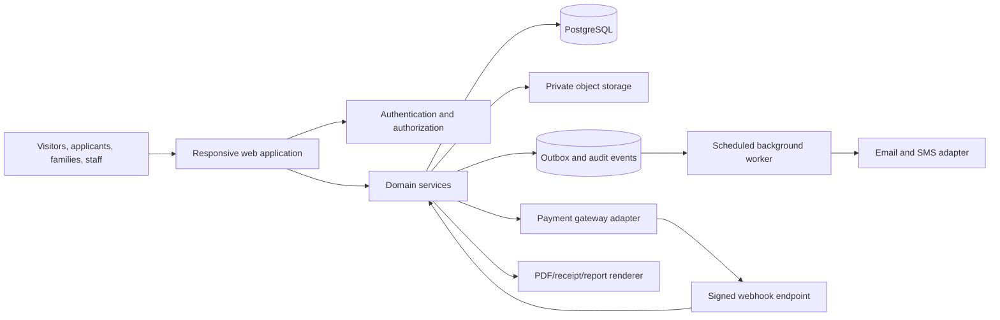
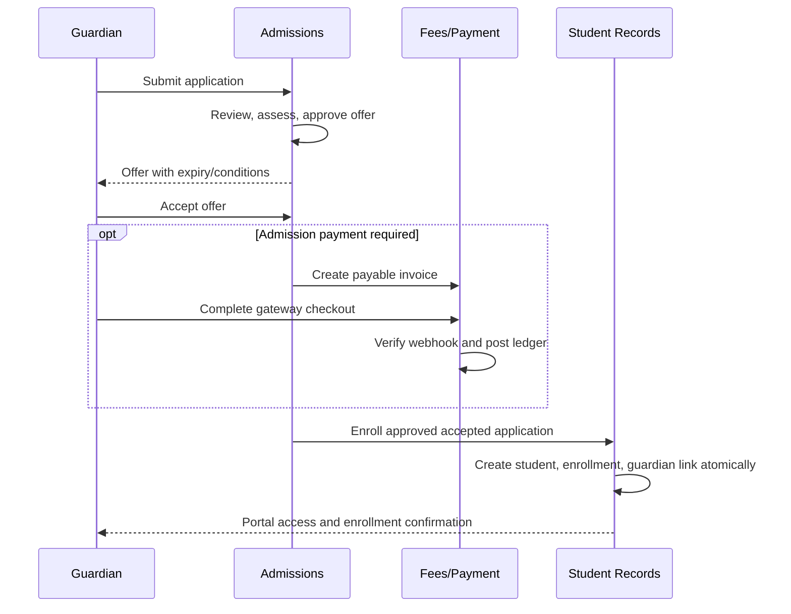

# Faiz Aam School Platform — Canonical Project Blueprint

Version: 1.3
Date: 24 August 2026
Status: Approved product baseline; local implementation is provider-ready, while staging verification and school-specific decisions remain in progress.

This is the canonical product and engineering contract for the Faiz Aam School website and portal. It defines what must be built, how each feature behaves, how modules integrate, and what “done” means. Future AI agents and developers must read this file before changing the project.

Supporting documents:

- `AGENTS.md` — mandatory AI/developer instructions.
- `PROJECT-STATUS.md` — what is actually implemented and verified now.
- `plan.md` — active C0–C5 Supabase cutover order, gates, and provider handoff sequence.
- `FEATURE-INTEGRATION-SPEC.md` — detailed user relationships, shared contexts, feature connections, synchronization, and integration tests.
- `UI-COMPLETION-PLAN.md` — completed frontend reference and route-level acceptance evidence.
- `design/UX-BLUEPRINT.md` — UI direction and component mapping.
- `design/RESEARCH-NOTES.md` — research and primary implementation sources.

---

## 1. Product charter

### 1.1 Product goal

Create one coherent digital school service where:

- The public can understand and contact the school.
- Parents can apply for admission and later manage linked students.
- Parents can see authoritative fees, pay safely, and download receipts.
- Students and guardians can privately access results and timetables.
- Job candidates can apply to published vacancies and track their status.
- Authorised staff can review, publish, reconcile, and correct records with a complete audit trail.

### 1.2 Success criteria

The platform succeeds when it reduces office visits and manual reconciliation without making the school dependent on a complicated technical system.

Success means:

- A parent can complete an application or payment on a mobile phone and recover from interruption.
- A staff member can understand the current state of any application, invoice, payment, result, or timetable without checking multiple systems.
- Sensitive information is private by default and access is explainable.
- A retry, duplicate webhook, page refresh, or network failure does not duplicate a payment or submission.
- Every important staff action is attributable and reversible through a controlled correction, not hidden history deletion.
- Public content and operational services share one design system and account boundary.

### 1.3 Product principles

1. **Simple surface, strong internals.** The user sees a short, clear workflow; the system maintains validation, history, authorization, and recovery.
2. **One source of truth per domain.** The fee ledger, application timeline, published result version, and effective timetable each have one authoritative record.
3. **Private by default.** Public pages never expose student, guardian, applicant, financial, or staff-review data.
4. **Explicit state machines.** Applications, payments, results, vacancies, notifications, and documents move only through allowed states.
5. **Append or version; do not erase history.** Corrections add records or versions with reasons.
6. **Human approval for consequential decisions.** Admission decisions, offers, refunds, result publication, result correction, and job decisions require authorised staff.
7. **Provider-neutral core.** Payment, email/SMS, storage, and PDF providers are adapters around school-owned domain records.
8. **Accessible and mobile first.** Every essential flow works with keyboard, assistive technology, narrow screens, and slow networks.
9. **Configuration over code.** Academic years, grades, fees, application windows, periods, and templates are managed records, not scattered constants.
10. **No premature platform complexity.** Add infrastructure only after a measured requirement exists.
11. **One relationship context.** Guardian, student, enrollment, staff-role, and staff-assignment scope is resolved once and applied consistently to every consuming module.

### 1.4 Deliberate non-goals for the first release

Do not include these unless the blueprint is explicitly expanded:

- Learning management, online classes, homework submission, quizzes, or course content.
- Attendance capture, biometric attendance, payroll, HR employment records, or leave management.
- GPS bus tracking, transport routing, library circulation, hostel, inventory, or cafeteria systems.
- Social feeds, direct chat, discussion forums, advertising, or behavioural analytics for children.
- Native iOS/Android apps. The responsive web application is the first product.
- Microservices, GraphQL, Kafka, Redis, Elasticsearch, data lakes, or custom identity/payment infrastructure.
- Public result search by roll number, name, phone, or date of birth.
- Live campus-environment monitoring, sensor ingestion, device operations, or a facility-management launch commitment. The existing frontend demonstrator may remain isolated for design/reference use, but must not displace the core school journeys.

---

## 2. Users, roles, and responsibility boundaries

### 2.1 External users

| User | Primary needs | Account timing |
|---|---|---|
| Visitor | School information, notices, admissions, careers, contact | No account |
| Admission applicant guardian | Start/save/submit and track a student application | Lightweight verified applicant account |
| Job applicant | Apply to a vacancy, save draft, submit, withdraw, track | Lightweight verified applicant account |
| Guardian | View linked children, fees, receipts, results, timetable, notices | Permanent account after verified linking |
| Student | View own results, timetable, notices, documents | Permanent account when school policy permits |

### 2.2 Staff roles

| Role | Allowed responsibility | Explicitly excluded |
|---|---|---|
| Content editor | Draft and maintain public pages, notices, events, downloads | Cannot publish protected records or change finances |
| Content publisher | Review and publish public content | Cannot administer users by default |
| Admissions officer | Review applications, request changes, record assessments, recommend decisions | Cannot alter fee ledger or publish results |
| Admissions approver | Approve offers, waitlist, or decline with reason | Cannot bypass capacity without recorded override |
| Finance officer | Configure approved fee schedules, issue invoices, reconcile payments, initiate approved refunds | Cannot edit results or HR decisions |
| Finance approver | Approve refunds, write-offs, and financial adjustments | Cannot delete ledger history |
| Teacher | Enter assigned marks and view assigned class timetable | Cannot publish final results or view unrelated students |
| Exam reviewer | Moderate, lock, and return result batches | Cannot change source marks after lock without correction flow |
| Result publisher | Publish/withdraw approved result versions | Cannot silently edit a published result |
| Timetable manager | Create, validate, publish, and override timetables | Cannot change results or payments |
| HR reviewer | Review assigned job applications and score candidates | Cannot see protected student/finance records |
| HR approver | Advance/reject/offer candidates according to policy | Cannot expose internal panel notes to applicants |
| Support officer | Help users, view limited diagnostic state, create support records | Cannot impersonate users or view documents by default |
| Auditor | Read audit, workflow, and reconciliation evidence | Read-only |
| System administrator | Manage configuration and access assignments | Business approvals still require the relevant functional role |

### 2.3 Role rules

- Roles are additive, but sensitive actions require the specific functional role even when the user is a system administrator.
- Staff access must support MFA.
- An individual must not approve their own high-risk action when maker/checker policy applies, especially refunds and result corrections.
- Permissions are checked on the server against both role and record scope: assigned class, linked student, assigned review panel, or relevant module.
- UI visibility is not authorization.

---

## 3. System architecture

### 3.1 Architecture style

Use a **modular monolith**. One deployable web application contains public pages, portals, staff workspaces, API endpoints, and background-task entry points. Modules share one PostgreSQL database but own their service logic and tables.



### 3.2 Recommended default stack

Use current supported stable releases at implementation time and verify against official documentation.

- **Application:** Next.js App Router with TypeScript and React.
- **UI:** custom design tokens and components; Tailwind CSS or CSS modules for implementation speed; Radix-style accessible primitives only where useful. Do not inherit a generic component-library visual identity.
- **Validation:** shared Zod schemas at trust boundaries; browser hints are supplemental.
- **Forms:** server-backed forms with autosave where specified; React Hook Form is acceptable for complex client forms.
- **Database:** PostgreSQL.
- **Managed platform default:** Supabase for PostgreSQL, authentication, and private object storage, provided account ownership and regional requirements are approved.
- **Database access:** a typed query layer with migrations. Prefer explicit SQL/queries for financial and reporting paths; avoid hiding transactions behind overly magical abstractions.
- **Hosting default:** Vercel or an equivalent managed Node runtime for the single web application.
- **Background work:** database outbox plus a scheduled worker/cron endpoint. Do not introduce a separate queue until volume proves it necessary.
- **Payments:** gateway adapter for an approved Indian provider supporting INR, UPI Intent/QR, cards/net banking, signed webhooks, refunds, settlements, and sandbox testing.
- **Notifications:** adapter for email and optional SMS; templates are versioned records or code-owned templates with tests.
- **Documents:** private object storage and server-generated signed URLs with short expiry.
- **PDFs:** server-side HTML-to-PDF or a provider adapter for receipts, reports, and application acknowledgements.
- **Observability:** structured server logs, error tracking, health checks, audit events, and payment reconciliation reports.

### 3.3 Deployment units

Keep these as one product with four route areas:

- Public website.
- Applicant centre.
- Parent/student portal.
- Staff workspace.

They may use different layouts and middleware, but they share types, services, database, and deployment.

### 3.4 Module boundaries

Recommended source organization:

```text
src/
  app/
    (public)/
    (applicant)/
    (portal)/
    (staff)/
    api/
  modules/
    identity/
    school-config/
    content/
    admissions/
    careers/
    students/
    fees/
    payments/
    results/
    timetable/
    notifications/
    documents/
    support/
    audit/
    environment/
  components/
    public/
    portal/
    forms/
    data-display/
  lib/
    auth/
    db/
    validation/
    security/
    observability/
  styles/
  tests/
```

Each module should normally contain:

- Domain types and allowed states.
- Validation schemas.
- Server-side authorization helpers.
- Service functions implementing business rules.
- Repository/query functions.
- Module-specific tests.
- UI components only when they are not broadly shared.

### 3.5 Data conventions

- Primary keys: UUIDs generated by the system.
- Public references: separate non-sequential reference strings, never raw database IDs.
- Money: integer paise plus ISO currency; INR is configured, not assumed inside arithmetic.
- Time: UTC in storage; `Asia/Kolkata` for school-facing display and deadline interpretation.
- Academic scope: every dependent record carries or derives an `academic_year_id`.
- Status: constrained database value plus application-level transition validation.
- Deletion: archive/soft-delete configuration records; never delete financial, submitted application, published result, or audit history.
- Optimistic concurrency: version/revision field for staff-edited records where two editors could conflict.
- Audit: actor, action, target type/ID, timestamp, request/correlation ID, safe metadata, and reason where required.

---

## 4. Route and navigation blueprint

### 4.1 Public routes

```text
/
/about
/academics
/admissions
/admissions/apply
/school-life
/notices
/notices/[slug]
/disclosure
/careers
/careers/[vacancySlug]
/contact
/environment
/policies/privacy
/policies/accessibility
/policies/fees-and-refunds
/policies/terms
```

### 4.2 Applicant routes

```text
/apply/student
/apply/student/[applicationRef]
/apply/student/[applicationRef]/status
/apply/job/[vacancySlug]
/apply/job/[applicationRef]/status
```

### 4.3 Family/student portal routes

```text
/portal
/portal/fees
/portal/fees/[invoiceRef]
/portal/receipts/[receiptRef]
/portal/results
/portal/results/[publicationRef]
/portal/timetable
/portal/notices
/portal/documents
/portal/profile
/portal/security
/portal/support
```

### 4.4 Staff routes

```text
/staff
/staff/content
/staff/admissions
/staff/admissions/[applicationRef]
/staff/careers
/staff/careers/[applicationRef]
/staff/finance
/staff/finance/invoices
/staff/finance/payments
/staff/finance/reconciliation
/staff/results
/staff/results/[resultBatchRef]
/staff/timetables
/staff/notices
/staff/users
/staff/audit
/staff/settings
/staff/facility
/staff/facility/zones
/staff/facility/zones/[zoneId]
/staff/facility/history
/staff/facility/alerts
/staff/facility/devices
/staff/facility/reports
/staff/facility/display
```

Routes do not define permissions by themselves. Server authorization must protect every loader, mutation, download, and API endpoint.

The `/environment` and `/staff/facility/*` routes are an existing optional demonstrator. They are excluded from the core launch navigation and acceptance gate unless the school separately confirms a sensor programme, owner, budget, privacy policy, and operating process.

---

## 5. End-to-end feature specifications

## 5.1 Public website and content management

### Purpose

Establish trust, publish accurate school information, satisfy applicable disclosure obligations, and route users into admissions, careers, payments, results, and timetable services.

### Included public content

- Homepage with school identity, concise promise, service rail, current notice, admissions CTA, and contact/disclosure access.
- About: verified history, mission, leadership, and governance.
- Academics: grades offered, curriculum, school calendar, examination approach, and learning stages.
- Admissions: eligibility, dates, process, required documents, fee information approved for publication, and apply CTA.
- School life: facilities and activities described without relying on unverified imagery.
- Notices: category, title, summary, publish date, expiry, attachment, and audience.
- Disclosure: affiliation and statutory documents only after verification.
- Careers: open/closed vacancies and vacancy detail.
- Contact/grievance: verified channels, office hours, map/address, and escalation information.
- Policies: privacy, accessibility, terms, fee/refund, applicant retention, and acceptable use.

### CMS workflow

`DRAFT → IN_REVIEW → SCHEDULED or PUBLISHED → ARCHIVED`

- Editors create drafts and preview exactly how content will render.
- Publishers approve and publish; scheduling uses school timezone.
- Every content item has owner, last reviewed date, and next review date.
- Expired notices are removed from current lists but remain in an archive when policy allows.
- Attachments have title, type, size, language, and accessible description.
- Published revisions create history; rollback creates a new revision.

### Business rules

- Unverified affiliation, results, statistics, leadership, contacts, fees, or dates must not be published as fact.
- Mandatory disclosure is prominent only when applicable to the confirmed board.
- Public analytics must be privacy-preserving and must not profile children.
- Search indexes only public published content.
- Urgent notices have explicit start/end time and cannot permanently dominate the homepage.

### Acceptance criteria

- A content editor cannot publish without publisher permission.
- Scheduled content appears and expires at correct school-local times.
- Archived/private attachments cannot be retrieved through old public URLs.
- Public pages meet accessibility, responsive, metadata, sitemap, and performance gates.

## 5.2 Identity, authentication, and account linking

### Purpose

Give each user the minimum account strength and access required for their role while keeping applicant access simple.

### Account types

- **Applicant account:** verified email or phone; access only to owned student/job applications.
- **Guardian account:** verified permanent account linked to one or more students through an approved relationship.
- **Student account:** linked to exactly one student record unless policy explicitly supports otherwise.
- **Staff account:** invited by an administrator, assigned scoped roles, MFA required.

### Authentication behavior

- Email magic link or OTP and phone OTP are acceptable for applicants/guardians when provider support and delivery are reliable.
- Staff use stronger sign-in with MFA and shorter privileged sessions.
- Sessions use secure, `HttpOnly`, `SameSite` cookies; never store auth tokens in `localStorage`.
- Login, logout, recovery, MFA changes, suspicious failures, and role changes are audited.
- Rate-limit OTP issue/verify, login, recovery, and invitation endpoints.
- Recovery does not reveal whether an account exists.

### Guardian/student linking

Preferred flow:

1. Enrollment creates or imports the student record.
2. School records at least one guardian relationship and verified contact.
3. Guardian signs in with the matching verified contact or receives a one-time school-issued linking invitation.
4. System checks relationship and invitation state.
5. Guardian confirms the student link.
6. Link becomes active and is audited.

Manual linking requires authorised staff and a recorded reason. Support staff cannot link students based solely on a phone call without verification.

### Acceptance criteria

- A guardian can only query students through active guardian/student links.
- A student cannot access another student by changing a URL or ID.
- Disabling an account revokes sessions and prevents signed URL generation.
- Staff MFA and role scope are enforced in integration tests.

## 5.3 Student admission registration

### Purpose

Accept complete, reviewable applications without creating permanent student records too early.

### Applicant form sections

1. Application context: academic year, desired grade, campus if applicable.
2. Student identity: legal name, preferred name if used, date of birth, gender only if legitimately required, and relevant identifiers.
3. Guardian/contact: guardian names, relationship, verified email/phone, alternate contact.
4. Address: residential and correspondence address.
5. Previous education: school, class, board/curriculum, year, medium, transfer context.
6. Support/accommodation: collect only what is necessary for admissions; restrict medical details.
7. Documents: configured checklist based on grade/application type.
8. Review and declaration: read-only summary, privacy notice, accuracy declaration, consent.

### Applicant workflow

`DRAFT → SUBMITTED → UNDER_REVIEW → CHANGES_REQUESTED → UNDER_REVIEW → ASSESSMENT → DECISION_PENDING → OFFERED / WAITLISTED / DECLINED → OFFER_ACCEPTED → ENROLLED`

Additional terminal states: `WITHDRAWN`, `EXPIRED`, `DUPLICATE_CLOSED`.

### Workflow rules

- Grade/application window/capacity are configuration records.
- Drafts autosave by section and show last-saved state.
- Submission creates an immutable submitted snapshot and reference number.
- Staff requests for changes identify fields and deadline; applicant edits create a new submitted version.
- Only an admissions approver can issue an offer, waitlist, or decline.
- Offer records include expiry, conditions, acceptance requirements, and any approved admission-payment requirement.
- Enrollment is a controlled conversion that creates student/enrollment/guardian links in one transaction.
- Decline reasons may have internal and applicant-safe forms.
- Capacity override requires permission and reason.

### Staff workspace

- Filter by year, grade, status, assigned reviewer, submission date, and change deadline.
- Show completeness, potential duplicates, documents, version history, review notes, and event timeline.
- Assignment, scorecard, assessment scheduling, decision recommendation, and approval are distinct actions.
- Bulk export is restricted, audited, and excludes documents unless explicitly authorised.

### Documents

- Document requirements are configured by application type.
- Allowed types, size, page count, and malware scan result are enforced.
- Staff views use short-lived signed access and log sensitive downloads.
- Replacement creates a new document version; previous submitted evidence remains retained under policy.

### Applicant communications

- Draft reminder if policy allows.
- Submission acknowledgement.
- Change request with deadline.
- Assessment invitation/reschedule.
- Decision notice.
- Offer expiry reminder.
- Enrollment confirmation.

Every message references the application reference, not sensitive student data in the subject/SMS.

### Failure and recovery behavior

- If autosave fails, retain local form state temporarily and show a retry action without claiming it is saved.
- If submission is retried, idempotency returns the existing submission.
- If a file scan is pending, submission may be `SUBMITTED` but review is blocked until scan completion.
- If offer payment succeeds after apparent browser failure, webhook reconciliation continues enrollment readiness.

### Acceptance criteria

- Applicant can leave and resume on another device.
- Submitted data cannot be silently changed.
- Only owned applications are visible to applicants.
- Staff actions obey role, scope, and state transitions.
- Enrollment creates one student and does not duplicate on retry.
- Complete timeline and submitted-version evidence are available to auditors.

## 5.4 Job vacancies and applications

### Purpose

Provide a respectful, vacancy-specific recruitment process without turning the system into a full HR platform.

### Vacancy content

- Title, department, employment type, location, summary, responsibilities, essential/desirable criteria, required documents, opening/closing time, contact, and status.
- Optional structured screening questions and scorecard.
- Published, closed, filled, or archived state.

### Applicant form sections

1. Personal/contact details.
2. Role-relevant qualifications.
3. Employment/teaching experience.
4. Structured vacancy questions.
5. Required documents: CV, qualifications, teaching credential where applicable.
6. References only when policy requires and at the appropriate stage.
7. Review, privacy notice, declaration, consent.

### Workflow

`DRAFT → SUBMITTED → ELIGIBILITY_REVIEW → SHORTLISTED → INTERVIEW → REFERENCE_CHECK → OFFERED → ACCEPTED`

Alternative terminal states: `NOT_SELECTED`, `WITHDRAWN`, `EXPIRED`, `VACANCY_CANCELLED`.

### Rules

- One person may apply to multiple vacancies, but each application is independent.
- Submission creates an immutable snapshot.
- Internal notes and scorecards are never shown to applicants.
- Applicant-safe status text is separate from internal state/reason.
- Panel members see only assigned vacancies/applications.
- Conflicts of interest can be recorded and remove a reviewer from an application.
- Withdrawal is applicant-controlled until a configured terminal point and remains in audit history.
- Retention and deletion/anonymisation schedule is shown at collection and enforced by a scheduled job after holds expire.
- Hiring outcome does not create payroll or employee-management records in this release.

### Acceptance criteria

- Closed vacancies reject new drafts/submissions according to policy.
- HR cannot access student admissions or fees by virtue of HR role.
- Score changes are attributed and versioned.
- Applicant receives acknowledgement and can see an accurate, safe status.
- Retention jobs can identify records eligible for deletion/anonymisation without affecting audit/legal holds.

## 5.5 Student, guardian, and enrollment records

### Purpose

Maintain the minimum authoritative student identity and academic placement required by fees, results, timetable, and portal access.

### Included records

- Student identity and school-issued student number.
- Guardian relationships and contact preference.
- Academic-year enrollment, grade, section, status, start/end dates.
- Narrow support/accommodation flags where operationally required.
- Portal account links.

### Rules

- An admission application is not the permanent student record.
- Enrollment conversion maps approved fields and records source application/version.
- A student may have multiple historical enrollments but only one active enrollment per academic year unless an explicit transfer scenario is modeled.
- Grade/section changes create enrollment history, not overwrites.
- Guardian relationship removal/restriction requires staff reason and immediate access revocation where applicable.
- Medical/support information uses separate permission checks and is excluded from general lists/exports.
- One guardian may link to several students and one student may link to several verified guardians. Billing responsibility, emergency contact, and legal relationship are separate facts when policy requires them.
- A user account may carry several roles, but every workspace and server action uses the exact active role plus guardian-link or staff-assignment scope.
- Student placement belongs to enrollment, not the permanent student identity row.
- The family portal uses one active student/enrollment context across overview, fees, receipts, results, timetable, notices, documents, support metadata, and profile.

The complete relationship lifecycle, active-context behavior, and synchronization rules are normative in `FEATURE-INTEGRATION-SPEC.md` §§3–5.

### Acceptance criteria

- Fee, result, and timetable views derive the correct academic enrollment.
- Historical years remain viewable according to policy.
- Guardian access changes take effect immediately.
- Student numbers and public references are unique and non-predictable externally.

## 5.6 Fee schedules, invoices, and concessions

### Purpose

Create an authoritative school fee ledger before adding online payment.

### Fee configuration

- Academic year, grade/section applicability, fee category, amount, due schedule, tax treatment if applicable, refundable flag, and active dates.
- Categories may include tuition, admission, transport, examination, activity, or other approved types.
- Configuration changes create versions and do not rewrite issued invoices.

### Invoice model

- Invoice header: student, academic year, issue date, due date, status, currency, total, balance, public reference.
- Line items: fee category, description, quantity, unit amount, concession/adjustment links.
- Ledger entries: charge, payment allocation, concession, adjustment, refund, write-off where policy allows.

### Invoice workflow

`DRAFT → ISSUED → PARTIALLY_PAID → PAID`

Additional states: `OVERDUE`, `VOID` for unused/invalid invoices before payment, and `CREDITED` through controlled adjustment. Never delete an issued invoice.

### Concessions and adjustments

- Concessions are explicit records with type, value, authority, reason, effective scope, and approval.
- An approved concession changes balance through a ledger entry, not direct total mutation.
- Manual financial adjustments require finance permission, reason, and maker/checker approval above a configured threshold.
- Partial payment policy is configuration by invoice/fee type.

### Staff workspace

- Issue individual or batch invoices from an approved fee schedule.
- Preview and validate before issuing.
- Search by student/reference/status/year, not by sensitive broad exports by default.
- View immutable ledger and payment/refund allocation.
- Produce outstanding, collection, settlement, and exception reports.

### Acceptance criteria

- Sum of ledger entries equals invoice balance deterministically.
- Issued invoice amounts do not change when fee schedules are edited later.
- Duplicate batch issuance is prevented by unique academic scope/idempotency.
- Every concession and adjustment has authority and reason.
- Parent view matches finance view for the same ledger state.

## 5.7 Online payments, receipts, refunds, and reconciliation

### Purpose

Let guardians pay school invoices safely while preserving the school ledger as the source of truth.

### Payment flow

1. Guardian signs in and selects a linked student and payable invoice(s).
2. Server rechecks authorization, current balance, partial-payment policy, and amount.
3. Server creates a `payment_attempt` and gateway order with a unique idempotency key.
4. Client opens provider checkout using the server-created order/session.
5. Browser return displays `PROCESSING`, never final success based only on callback parameters.
6. Signed webhook is verified against the raw body.
7. Server stores the gateway event once and fetches provider status when necessary.
8. Confirmed successful payment creates one payment record and ledger allocation in a transaction.
9. Receipt number is generated only after confirmed success/capture.
10. Outbox schedules receipt notification and PDF generation.

### Payment states

`CREATED → CHECKOUT_OPENED → PENDING → SUCCEEDED`

Alternative states: `FAILED`, `USER_DROPPED`, `EXPIRED`, `LATE_AUTHORISED`, `REFUND_PENDING`, `PARTIALLY_REFUNDED`, `REFUNDED`, `DISPUTED`.

Internal payment state must be mapped from provider-specific states through the gateway adapter.

### Provider adapter contract

- Create order/session.
- Verify client-return signature if used.
- Verify webhook signature from raw payload.
- Fetch order/payment.
- Initiate refund.
- Fetch refund.
- Normalize payment/refund/settlement events.
- Produce stable provider IDs and safe diagnostics.

### Webhook rules

- Store provider event ID/body hash, type, received time, verification outcome, processing state, and attempt count.
- Unique provider event ID/body hash prevents duplicate processing.
- Handler acknowledges only after durable event storage.
- Processing is idempotent and safe to retry.
- Unknown orders or amount/currency mismatches go to an exception queue and never post to the ledger automatically.
- Secrets and full sensitive payloads are not logged.

### Receipts

- Sequential or policy-approved receipt number generated server-side.
- Includes school identity, payer-safe details, student reference, invoice allocation, amount, method summary, gateway reference, date, and status.
- PDF is reproducible from stored records and template version.
- Receipt is never issued for merely pending/authorised states when capture is required.

### Refunds

1. Finance officer creates refund request against eligible payment/allocation.
2. System validates refundable amount and policy.
3. Finance approver approves when maker/checker is required.
4. Gateway refund is initiated with idempotency key.
5. Webhook/fetch confirms provider outcome.
6. Ledger receives refund entry; original payment remains.
7. Parent sees refund status and updated balance.

### Reconciliation

- Daily job compares gateway successful payments/refunds/settlements with internal payment and ledger records.
- Exceptions: gateway-only success, internal-only success, amount mismatch, duplicate reference, pending beyond threshold, failed notification, settlement mismatch.
- Finance resolves each exception with an audited action.
- Reconciliation reports are retained and exportable.

### UPI and mandates

- Use UPI Intent/QR supported by the selected gateway; do not make manual VPA Collect the primary path.
- Recurring mandates are optional and out of initial scope unless the school approves policy and provider support.
- If added, mandates require explicit opt-in, amount/frequency/validity display, pre-debit notice handling, and pause/revoke visibility.

### Acceptance criteria

- Duplicate return/webhook/retry produces one payment and one receipt.
- Amount/currency/student/invoice mismatch cannot post.
- A successful gateway payment eventually appears through webhook or reconciliation even if the browser closes.
- Refunds preserve original history and never exceed eligible amount.
- Finance can account for every gateway transaction and exception.

## 5.8 Results, report cards, and publication

### Purpose

Allow assigned teachers to enter marks and authorised exam staff to moderate and privately publish versioned results.

### Configuration

- Academic year and term/exam.
- Applicable grades/sections.
- Subjects and assessment components.
- Maximum marks, pass rules, grade bands, rounding policy, absent/exempt/not-applicable codes.
- Aggregate and ranking visibility policy.
- Publication window and report template.

Configuration becomes locked or versioned once marks are entered.

### Workflow

`DRAFT → MARK_ENTRY_OPEN → SUBMITTED_FOR_REVIEW → UNDER_REVIEW → APPROVED → PUBLISHED`

Alternative states: `RETURNED_FOR_CORRECTION`, `WITHDRAWN`, `SUPERSEDED`.

### Entry and validation

- Teachers see only assigned subject/class components.
- Mark entry validates numeric range and allowed non-numeric statuses.
- Bulk import requires a preview showing accepted/rejected rows before commit.
- Submission locks the teacher’s current version.
- Missing marks, impossible totals, duplicate students, invalid enrollment, and suspicious outliers are flagged.

### Moderation and publication

- Reviewer can approve or return with a reason.
- Result publisher selects an approved result batch and explicit audience.
- Publication creates an immutable `result_publication` referencing exact result versions and template version.
- Parent/student access checks linked student and active/allowed historical enrollment.
- Search engines and public routes never receive result content.

### Corrections

1. Authorised staff opens a correction request with reason and affected records.
2. Appropriate approver authorises correction.
3. New result version is entered and reviewed.
4. New publication supersedes the old version.
5. Users see correction date/status when policy requires.
6. Prior version remains available to authorised auditors.

### Student/guardian view

- Academic year and term selector.
- Publication state: provisional/final/corrected where applicable.
- Subject, component/total, grade, explicit result status, and approved remark. Attendance is shown only if the project scope and school policy are explicitly expanded.
- Overall summary only when policy allows.
- Accessible HTML is primary; downloadable PDF is supplementary.

### Acceptance criteria

- Teacher cannot enter marks for an unassigned class/subject.
- Invalid marks and missing required records prevent submission.
- Publication requires an approved locked batch.
- A published result cannot be edited in place.
- Guardian/student sees only the linked/own result.
- Corrected reports identify the current version and preserve history.

## 5.9 Class timetables and exam date sheets

### Purpose

Publish reliable class schedules and exam dates while handling substitutions and temporary changes without destroying the base plan.

### Separate concepts

- **Class timetable:** repeating weekly periods for a class/section.
- **Exam date sheet:** dated examination schedule with subject, time, location, and instructions.
- **Override:** date-specific change to a published class timetable.

### Timetable configuration

- Working days.
- Period definitions and breaks.
- Grades/sections.
- Subjects.
- Teachers and allowed assignments.
- Rooms/labs and capacity/type.
- Effective date range.

### Workflow

`DRAFT → VALIDATED → PUBLISHED → SUPERSEDED`

### Conflict checks

- Teacher double-booked in overlapping periods.
- Room double-booked.
- Section double-booked.
- Subject/teacher assignment not valid for class.
- Period outside school day or on non-working day.
- Missing required recurring periods according to configured rules when those rules exist.

Warnings may be allowed only for explicitly classified soft constraints. Hard conflicts block publication.

### Overrides

- Date-specific substitute teacher, subject, room, cancellation, or special period.
- Override records reason, creator, effective date, audience, and optional notice.
- Base timetable remains unchanged.
- Expired override remains in history but does not affect future dates.

### Exam date sheet

- Exam batch, academic year, grade/section, subject, date, start/end, room, instructions, publication state.
- Conflict validation for student cohort, teacher/invigilator if modeled, and room.
- Revision creates a new published version and targeted notice.

### Acceptance criteria

- Hard conflicts cannot be published.
- Portal defaults to the student’s current class/section and today/week view.
- A date-specific override appears correctly and does not mutate other dates.
- Superseded timetables remain auditable.
- Exam and class schedules are visibly distinct.

## 5.10 Notices and notifications

### Purpose

Publish information once, target it correctly, and deliver optional alerts without making email/SMS the source of truth.

### Notice audiences

- Public.
- All authenticated users.
- Guardians/students by academic year, grade, section, or specific linked records.
- Staff by role or assignment.
- Admission/job applicants by owned application or status.

### Notice model

- Title, summary, body, category, audience rule, priority, publish/expiry time, attachments, author, approval, and revision.
- Portal always shows the authoritative notice even if email/SMS delivery fails.

### Notification outbox

Domain action creates an outbox record in the same database transaction. A scheduled worker:

1. Selects pending items with a lock.
2. Resolves recipient and preferred channel.
3. Renders a versioned template.
4. Sends through the provider adapter.
5. Stores provider reference and delivery state.
6. Retries transient failures with bounded backoff.
7. Moves permanent failures to review state.

### Rules

- Do not put sensitive marks, full application data, documents, or payment credentials in email/SMS.
- Use reference numbers and secure portal links.
- Urgent priority does not bypass consent/channel policy except where legally/policy justified.
- Users can manage non-essential notification preferences; transactional notices required for service integrity remain enabled according to policy.
- Recipient expansion is stored or reproducible for audit.

### Acceptance criteria

- Failed notification does not roll back the completed domain action.
- Retry does not send duplicate messages when provider/idempotency support exists.
- User can always find authoritative status in the portal.
- Staff can see delivery failures without accessing message secrets.

## 5.11 Documents, downloads, and generated PDFs

### Purpose

Safely manage application evidence, policies, receipts, reports, and acknowledgements.

### Document classes

- Public CMS attachment.
- Private admission document.
- Private job application document.
- Generated receipt.
- Generated result report.
- Generated application acknowledgement.
- Staff-only evidence/export.

### Upload pipeline

1. Server authorizes upload intent and returns constraints.
2. Client uploads to a quarantine/private location.
3. System verifies size, extension, actual type, and filename policy.
4. Malware scan or approved scanning service runs.
5. Clean file moves/becomes available in the final private location.
6. Document record stores checksum, type, size, uploader, source, scan state, and version.

### Access rules

- Private documents are never public URLs.
- Server checks record authorization before issuing a short-lived signed URL or streaming content.
- Sensitive staff downloads are audited.
- Filenames exposed to users are safe display names, not storage paths.
- Generated PDFs include template version and source record/version.

### Acceptance criteria

- Disallowed or malicious files cannot become downloadable.
- Guessing object paths cannot bypass authorization.
- Replaced documents retain required version evidence.
- Generated PDFs can be reproduced from authoritative records.

## 5.12 Support and grievance handling

### Purpose

Give users a recoverable route when workflows fail without granting support staff excessive access.

### Included functions

- Public contact/grievance form with rate limiting and safe categories.
- Authenticated support request linked to user and optional safe record reference.
- Status: `OPEN → IN_PROGRESS → WAITING_FOR_USER → RESOLVED → CLOSED`.
- Assignment, internal notes, applicant/user-visible responses, and resolution category.

### Rules

- Support staff see the minimum record summary needed.
- No password, OTP, full payment credential, or sensitive document is requested through support forms.
- Account linking, financial adjustment, application decision, or result correction must use the relevant module’s authorised workflow, not a support shortcut.
- Impersonation is out of scope. If later added, require explicit user consent, banner, time limit, and full audit.

### Acceptance criteria

- Support cannot mutate protected domain records directly.
- Users can see their request status and safe responses.
- Spam/rate-limit controls and privacy notice are present.

## 5.13 Staff dashboard, configuration, and audit

### Purpose

Provide orientation and work queues, not a decorative dashboard.

### Staff home

Show only relevant operational queues:

- Applications awaiting review/change deadline/decision.
- Payment and reconciliation exceptions.
- Result batches awaiting submission/review/publication.
- Timetable conflicts/drafts/overrides.
- Content awaiting review or nearing review date.
- Failed notification/document processing items.

### Configuration

- School identity and verified contacts.
- Academic years, grades, sections, subjects, periods, rooms.
- Application windows and document requirements.
- Fee categories/schedules and approval thresholds.
- Result structures/grade bands.
- Notification templates/channels.
- Retention policies and feature flags.

Changes are versioned where they affect existing records.

### Audit explorer

- Filter by actor, module, action, target reference, date, and correlation ID.
- Safe before/after metadata for allowed fields; never log secrets or unnecessary sensitive payloads.
- Audit records are append-only and inaccessible to ordinary editors.

### Acceptance criteria

- Staff home content follows role/scope.
- Configuration changes cannot rewrite issued/published history.
- High-risk actions require reason and, where configured, approval.
- Auditor has read-only evidence without business mutation access.

## 5.14 Campus environment monitoring (optional deferred demonstrator)

### Purpose

Preserve the existing frontend demonstrator as proof of the platform's route, contract, and design-system foundation. It is not a core launch feature and must not receive backend, ingestion, device, or operational expansion until separately commissioned by the school.

### Included functions

- Public campus-environment page: outdoor conditions, indoor comfort summary by zone, sensor-type explainers, and seasonal advisory notices. No private building data exposed.
- Staff facility workspace: live overview, zone detail, reading history with charts, alert acknowledgement/resolution, sensor device registry, and period report generation.
- Hallway wallboard view for staff screens.

### Scope boundaries

- The demonstrator is frontend-only: typed contracts, domain rules, and demo data exist now; persistence, ingestion, and real device adapters remain out of scope unless the sensor programme is separately recommissioned.
- All displayed readings are clearly marked fictional demo data until a real sensor fleet and ingestion pipeline exist.
- No cameras, occupancy identity tracking, public search of readings, or third-party IoT platform dependency.
- Keep the module isolated from admissions, finance, results, timetable, and identity work. Do not include it in the core launch gate or primary navigation while it is deferred.

### Rules

- Thresholds (thermal comfort, CO₂, PM2.5/CPCB AQI bands, noise, light) live in domain logic, not components.
- Readings are append-only time series; alerts carry severity and a staff acknowledgement/resolution trail.
- Time is UTC in storage, displayed in `Asia/Kolkata`; the wallboard never auto-rotates without a manual pause control.
- Device references are non-sequential; no predictable identifiers in public URLs.

### Acceptance criteria

- A public visitor can read current campus conditions and season guidance without signing in.
- Facility staff can see live zone summaries, open alerts, a 24h–30d history with threshold bands, and can acknowledge/resolve alerts and generate a period report.
- Demo mode is explicit on every data surface; no real student, staff, or building data is fabricated as real.
- Charts and alerts meet WCAG 2.2 AA (text alternatives, no color-only meaning, reduced motion).

---

## 6. Cross-module integration contracts

### 6.1 Admission to enrollment



Enrollment readiness must be computed from explicit conditions; UI buttons do not decide eligibility.

### 6.2 Enrollment to fees/results/timetable

- Fee invoice targets an enrollment/student in an academic year.
- Result entry roster is derived from eligible enrollments at the exam scope.
- Portal timetable is derived from current/historical enrollment class/section and effective date.
- Deactivating or transferring enrollment updates future access/scope without deleting historical records.

### 6.3 Domain event/outbox examples

Use transactionally stored events for:

- `admission.application_submitted`
- `admission.changes_requested`
- `admission.offer_issued`
- `student.enrolled`
- `invoice.issued`
- `payment.succeeded`
- `payment.refund_confirmed`
- `result.published`
- `timetable.published`
- `timetable.override_created`
- `job.application_submitted`
- `job.status_changed`

Events trigger notifications or document generation. They do not replace the domain tables as the source of truth.

### 6.4 Idempotency boundaries

Require idempotency keys or unique constraints for:

- Application submit.
- Offer acceptance.
- Enrollment conversion.
- Batch invoice issue.
- Payment order creation.
- Gateway event processing.
- Receipt number generation.
- Refund initiation.
- Result publication.
- Notification send attempts.

### 6.5 Relationship, context, and propagation contract

- Identity answers who the actor is; roles answer what capability is available; guardian links and staff assignments answer which records are in scope.
- A family page never selects its own student independently. It consumes the shared active student, enrollment, academic year, and link-capability context.
- A teacher’s marks/timetable scope comes from effective class/section/subject assignments. Employment title or a broad staff role is insufficient.
- Enrollment is the operational join between student identity and fees, result rosters, timetable placement, enrollment-targeted notices, and school documents.
- Domain writes return the authoritative record and invalidate affected projections. Notifications and PDF rendering may follow asynchronously through the outbox; they never become the source of truth.
- Admission-fee payment uses the ordinary finance ledger/payment/receipt flow. It cannot maintain a separate UI-only payment state.
- Portal and staff views of the same invoice, publication, timetable version, application timeline, or support response must read the same owning service.
- Link or role revocation triggers immediate permission revalidation and removes stale cached access without erasing historical audit or attribution.

`FEATURE-INTEGRATION-SPEC.md` defines entity cardinalities, context reset rules, synchronous transaction boundaries, eventual delivery behavior, the UI invalidation matrix, and required cross-module tests.

---

## 7. Canonical data model

This is a logical model. Exact columns and indexes belong in migrations, but table responsibilities must remain recognizable.

### 7.1 Identity and access

- `people`: minimum person identity used to relate accounts, guardians, and staff without merging their domain records.
- `users`: application profile linked to auth-provider identity; status and safe contact metadata.
- `roles`: stable role definitions.
- `user_roles`: user, role, optional scope, granted/revoked metadata.
- `staff_assignments`: teacher/class/subject or panel assignments.
- `guardian_student_links`: relationship, status, verification source, start/end.
- `account_invitations`: purpose, hashed token/reference, expiry, state.

### 7.2 School configuration

- `school_profiles`
- `academic_years`
- `grades`
- `sections`
- `subjects`
- `rooms`
- `period_definitions`
- `staff_members`
- `enrollments`

### 7.3 Admissions

- `admission_windows`
- `admission_applications`
- `admission_application_versions`
- `admission_documents`
- `admission_reviews`
- `admission_assessments`
- `admission_offers`
- `admission_events`

### 7.4 Careers

- `job_vacancies`
- `job_applications`
- `job_application_versions`
- `job_documents`
- `job_review_assignments`
- `job_scorecards`
- `job_interviews`
- `job_events`

### 7.5 Students and guardians

- `students`
- `guardians`
- `guardian_student_links`: relationship, verification, capabilities/restrictions, effective dates, approver, and version.
- `enrollments`: student, academic year, grade/section, lifecycle status, effective dates, and source conversion/import.
- `enrollment_conversions`: idempotent application-to-student/enrollment/link result and source references.
- `student_support_records` with narrower access if required.

### 7.6 Fees and payments

- `fee_schedule_versions`
- `fee_schedule_items`
- `invoices`
- `invoice_items`
- `concessions`
- `ledger_entries`
- `payment_attempts`
- `payments`
- `payment_allocations`
- `gateway_events`
- `refund_requests`
- `refunds`
- `receipts`
- `reconciliation_runs`
- `reconciliation_exceptions`

Financial invariants:

- Payment provider IDs and receipt numbers are unique.
- Ledger entry amounts are signed integer paise with constrained type.
- Allocation cannot exceed payment available amount or invoice eligible balance.
- Refund totals cannot exceed captured/eligible payment less prior confirmed refunds.

### 7.7 Results

- `exam_definitions`
- `assessment_components`
- `grade_band_versions`
- `result_batches`
- `mark_entries`
- `result_versions`
- `result_publications`
- `result_correction_requests`

### 7.8 Timetables

- `timetable_versions`
- `timetable_periods`
- `timetable_publications`
- `timetable_overrides`
- `exam_schedule_versions`
- `exam_schedule_entries`

### 7.9 Content and operations

- `content_items`
- `content_versions`
- `notices`
- `notice_audiences`
- `documents`
- `outbox_events`
- `notification_deliveries`
- `support_requests`
- `support_events`
- `audit_events`
- `feature_flags`

### 7.10 Required database controls

- Foreign keys for every ownership/scope relation.
- Unique constraints for natural idempotency and public references.
- Check constraints for money, dates, and constrained states where practical.
- Indexes aligned to staff queues and portal lookups.
- Row-level security when using a platform that supports it, backed by server authorization rather than treated as the only check.
- Transactions for multi-record state changes.
- Migration tests and rollback/forward-fix strategy.

### 7.11 Environment monitoring records

- `zones` — campus zones (classroom, library, laboratory, corridor, assembly hall, office, outdoor, grounds) with building/floor context.
- `devices` — fixed sensors (temperature, humidity, CO₂, PM2.5/PM10, noise, light) with status, battery, calibration, and non-sequential reference.
- `readings` — append-only metric samples (UTC, numeric value, unit) keyed to device and zone.
- `alerts` — severity, metric, zone/device scope, raised/acknowledged/resolved trail with actor and note.
- `environment_reports` — generated period reports with zone statistics; append-only once generated.

---

## 8. Authorization matrix

Legend: `O` own/linked records, `A` assigned scope, `R` read, `W` write, `P` approve/publish, `—` denied.

| Capability | Applicant | Guardian | Student | Teacher | Admissions | Finance | Exam reviewer/publisher | HR | Admin | Auditor |
|---|---:|---:|---:|---:|---:|---:|---:|---:|---:|---:|
| Public content | R | R | R | R | R | R | R | R | W/P by assigned role | R |
| Student application | O/W | O/W before enrollment | — | — | R/W/P by role | admission invoice only | — | — | config only | R |
| Job application | O/W | — | — | — | — | — | — | A/W/P | config only | R |
| Student profile | — | O/R | O/R | A/R minimal | A/R | A/R billing subset | A/R academic subset | — | scoped admin | R |
| Fee ledger | — | O/R/pay | own if policy | — | admission status only | R/W/P | — | — | scoped admin | R |
| Results | — | O/R | O/R | A/W draft | — | — | A/W/P | — | scoped admin | R |
| Timetable | — | linked/R | own/R | A/R | — | — | — | — | timetable role W/P | R |
| Private documents | O | O/linked | own | A/minimal | A | A billing only | A academic only | A job only | scoped | R where authorised |
| Audit | own timeline subset | own timeline subset | own subset | own actions | module | module | module | module | R | R |

The implementation must turn each cell into server-side policy functions and negative tests.

---

## 9. API and service conventions

### 9.1 Boundary rules

- UI calls application services through server actions or route handlers.
- Route handlers authenticate, parse, authorize, call a domain service, and map a safe response. They do not implement business workflows directly.
- Domain services own state transitions and transactions.
- Repositories/queries own persistence details and do not make authorization decisions.
- Client code never talks directly to privileged database/storage/payment APIs.

### 9.2 Request conventions

- Validate params, query, and body with shared schemas.
- Mutations use CSRF-resistant framework patterns and same-site session cookies.
- High-value create/retry operations accept an idempotency key.
- Use correlation/request IDs across logs, audit, provider calls, and safe error responses.
- Pagination is cursor-based for large staff lists.
- Filtering uses allowlisted fields and bounded date ranges.

### 9.3 Response and error conventions

Use stable error categories:

- `AUTH_REQUIRED`
- `ACCESS_DENIED`
- `VALIDATION_FAILED`
- `STATE_CONFLICT`
- `NOT_FOUND`
- `RATE_LIMITED`
- `PROVIDER_PENDING`
- `PROVIDER_FAILED`
- `RETRYABLE_FAILURE`
- `INTERNAL_ERROR`

Errors shown to users include a safe explanation and next action. Provider payloads, SQL errors, secrets, or internal stack traces are never returned to browsers.

### 9.4 State transition contract

Every workflow service must:

1. Load current record and version.
2. Authorize actor and scope.
3. Verify transition is allowed.
4. Validate required data/conditions.
5. Perform mutation in a transaction.
6. Add module event and audit record.
7. Add outbox event when asynchronous work is required.
8. Return the new authoritative state.

---

## 10. Security, privacy, and compliance baseline

### 10.1 Data classification

- **Public:** published school content and public notices.
- **Internal:** staff workflow metadata and non-sensitive configuration.
- **Confidential:** student/guardian/applicant identity, contact, applications, marks, fees, and internal reviews.
- **Restricted:** medical/support data, identity evidence, sensitive HR documents, authentication secrets, payment secrets.

Controls increase with classification.

### 10.2 Security controls

- TLS and HSTS in production.
- Secure session cookies; rotation/revocation and idle/absolute timeouts.
- MFA for privileged staff.
- Rate limiting and abuse detection for auth, OTP, application submit, support, upload, and payment order creation.
- Server-side authorization for every protected action.
- CSRF protection, safe CORS, security headers, and content security policy.
- Parameterized queries and output encoding.
- Secret manager/environment bindings; no secrets in code, logs, screenshots, or client bundles.
- Dependency and migration review.
- Structured security logging without sensitive payloads.
- Periodic access review and immediate staff offboarding.

### 10.3 Privacy controls

- Purpose-specific notice at collection.
- Collect only fields required by approved school policy.
- Verifiable guardian consent where legally/policy required for children.
- No targeted advertising or behavioural monitoring of children.
- Retention schedules by application/document/financial/academic category.
- Correction, access, withdrawal, and grievance handling as applicable.
- Processor/vendor inventory and contracts.
- Production data never copied into demos or development without approved de-identification.

### 10.4 Logging exclusions

Never log:

- Passwords, OTPs, magic links, session tokens, API keys, or webhook secrets.
- Raw card/UPI/payment credentials.
- Full uploaded document content.
- Unnecessary medical/support details.
- Complete gateway payloads when a safe event/reference subset is sufficient.

### 10.5 Compliance validation

Before production, school leadership/legal/finance owners must validate:

- Board-specific website disclosure obligations.
- Privacy notice, retention, and child-data processes.
- Fee/refund/late-fee language.
- Payment gateway merchant terms and receipt requirements.
- Applicant declarations and HR retention.
- Accessibility statement and grievance route.

---

## 11. Accessibility and UI implementation contract

### 11.1 Visual direction

Follow `design/UX-BLUEPRINT.md`:

- UI-led institutional composition; school photography is optional, not required.
- Ink, paper, saffron, willow, and chalk palette.
- Editorial serif plus legible sans-serif.
- Cardless sections, fine rules, clear tables, and restrained controls.
- Public identity is expressive; operational UI is calm and task-oriented.

### 11.2 Accessibility target

Target WCAG 2.2 AA for all public and authenticated routes:

- Semantic headings, landmarks, labels, tables, and status messages.
- Full keyboard operation and visible focus.
- Minimum target sizes and adequate contrast.
- Errors linked to fields and summarized at form top.
- No essential information conveyed only by color.
- Reduced motion and no focus-obscuring sticky UI.
- Accessible authentication and no unnecessary repeated entry.
- HTML-first results/receipts/notices; PDFs are supplementary and accessible where feasible.

### 11.3 Responsive contract

Core breakpoints are implementation details; behavior is not:

- Forms become single-column without losing progress or save state.
- Tables use prioritized columns, responsive disclosure, or controlled horizontal scrolling with labels.
- Service actions remain reachable with touch and keyboard.
- Payment/status screens remain readable after returning from external apps.
- No essential hover-only interaction.

### 11.4 UI state checklist

Every data surface needs:

- Loading/skeleton state without layout instability.
- Empty state explaining how data will appear.
- Permission-denied state.
- Recoverable error state.
- Stale/changed state for concurrency conflicts.
- Success/processing state with next step.
- Offline/autosave warning where relevant.

---

## 12. Reliability, observability, and operations

### 12.1 Reliability rules

- Transactions for multi-table business actions.
- Unique constraints plus idempotency for retried creates.
- Provider calls have timeouts and bounded retries.
- Async failures remain visible in outbox/exception queues.
- Browser success pages do not finalize provider-dependent state.
- Reconciliation repairs missed payment events.
- Version fields prevent lost staff updates.

### 12.2 Observability

- Structured logs with environment, service/module, request ID, actor ID/reference, action, safe target reference, outcome, and duration.
- Error tracking with source maps and sensitive-data filtering.
- Metrics: auth failures, application submit failures, autosave failures, webhook verification failures, pending payment age, reconciliation exceptions, notification failure rate, document scan failures, result publish failures.
- Health checks for application/database and background worker freshness.
- Alerts for repeated payment mismatch, webhook failure, job backlog, database/storage capacity, and auth abuse.

### 12.3 Backup and recovery

- Automated database backups with documented retention.
- Object storage versioning/backup as supported and required.
- Restore test before production and periodically thereafter.
- Recovery runbook identifies owner, recovery point objective, recovery time objective, and post-restore checks.
- Financial reconciliation and result publication integrity are verified after restore.

### 12.4 Data maintenance jobs

- Expire application offers and drafts according to policy.
- Retry outbox notifications/doc generation.
- Payment reconciliation.
- Close expired notices/vacancies.
- Apply approved retention/anonymisation schedules.
- Check content review dates and broken public links.
- Detect stuck workflow records.

---

## 13. Testing strategy

### 13.1 Test layers

1. **Unit tests:** state transition functions, fee calculations, grade calculations, authorization policy helpers, mapping/adapters.
2. **Database/integration tests:** constraints, transactions, RLS if used, repository queries, idempotency, audit/outbox creation.
3. **API/service tests:** authentication, authorization, validation, provider signature handling, safe errors.
4. **End-to-end browser tests:** critical user and staff journeys.
5. **Accessibility tests:** automated checks plus keyboard/screen-reader-oriented manual review.
6. **Security tests:** access-control matrix, IDOR attempts, upload abuse, CSRF/session settings, rate limiting, webhook tampering.
7. **Operational tests:** backup restore, reconciliation, scheduled jobs, provider sandbox, deployment health.

### 13.2 Required end-to-end scenarios

- Visitor reads notices and begins admission.
- Guardian starts, saves, resumes, submits, and tracks student application.
- Admissions requests changes; guardian resubmits; offer is issued/accepted; enrollment occurs once.
- Job applicant applies and withdraws; HR sees only assigned vacancy and records outcome.
- Finance issues invoice; guardian pays; webhook posts once; receipt downloads.
- Duplicate payment webhook and browser retry do not duplicate ledger/receipt.
- Failed/pending payment later succeeds and reconciles.
- Approved refund updates gateway/internal ledger and parent status.
- Teacher enters marks; reviewer returns/approves; publisher publishes; guardian sees linked result only.
- Result correction supersedes prior version without deletion.
- Timetable conflict blocks publication; corrected timetable publishes; one-day override appears.
- Role-negative scenarios for every staff module.

### 13.3 Fixture policy

- Use clearly fictional names, references, contacts, amounts, and results.
- Never use production exports in tests.
- Provider webhooks use signed sandbox fixtures with secret values supplied at runtime.

### 13.4 Release gate

Before release:

- Typecheck, lint, unit, integration, and critical E2E tests pass.
- Migration applies to a clean database and upgrade fixture.
- Authorization negative tests pass.
- Payment sandbox and webhook retry tests pass for payment changes.
- Accessibility scan and manual keyboard checks pass for changed UI.
- No secret or production data appears in repository/build output.
- Post-deploy smoke tests pass in the named environment.

---

## 14. Environments, configuration, and deployment

### 14.1 Environments

- **Local:** local developer services or isolated development project; fictional seed data.
- **Preview:** per-branch application with non-production services or isolated schemas; no production secrets/data.
- **Staging:** production-like configuration with provider sandboxes and controlled testers.
- **Production:** school-owned accounts, live domain, live gateway, restricted access, monitoring, backups.

### 14.2 Configuration categories

- Public runtime configuration: verified school name/contact and safe feature flags.
- Server secrets: database service credentials, auth secret, storage signing, payment keys/webhook secrets, notification credentials.
- Managed configuration records: academic settings, fee schedules, result structures, periods, templates.

Secrets are environment-managed and rotated after exposure. `.env.example` contains names and descriptions only.

### 14.3 Deployment sequence

1. Verify branch and intended environment.
2. Run full relevant release gate.
3. Apply reviewed forward migration.
4. Deploy application.
5. Verify health, authentication, public pages, protected route denial, and background worker.
6. For payment changes, verify live/test webhook endpoint configuration without real unintended charge.
7. Record release identifier, migrations, checks, and rollback/forward-fix path.

### 14.4 Domain and email

- Use a school-owned domain and role-based addresses.
- Configure SPF, DKIM, and DMARC for transactional email.
- Keep sender names and reply routes consistent and monitored.
- Do not send from personal staff accounts.

---

## 15. Implementation roadmap

The product phases prioritize working user journeys over route count. The UI
phase below is retained as a completed product reference; active execution is
the C0–C5 Supabase cutover in `plan.md`. This blueprint remains normative for
scope and architecture, not a progress log.

### Phase UI — frontend integration and contract freeze (completed reference)

- Preserve the validated editorial UI, completed self-contained demo journeys, typed domain-service work, test suite, and quality gates.
- Add shared typed person, student, guardian, staff, enrollment, role/assignment, and portal-context contracts.
- Make the linked-child selector functional with at least two fictional students and propagate the active enrollment to every portal module.
- Remove fixed `demoStudent` and mutable fixture-array reads from operational pages; route portal and staff consumers through the same owning services.
- Integrate accepted admission offers with the ordinary finance attempt/receipt service and an idempotent demo enrollment-readiness/conversion path.
- Make portal result rows come from the published student snapshot and consolidate the overlapping timetable service paths.
- Put notices, documents, notifications, users, settings, and audit behind typed boundaries sufficient for the backend handoff.
- Add cross-role denial, cross-student isolation, context-switch, stale-version, and cross-module propagation tests defined in `FEATURE-INTEGRATION-SPEC.md`.
- Keep the optional environment/facility demonstrator isolated and excluded from the core launch gate.

**Exit criteria**

- Every retained core journey and required cross-module propagation can be completed against deterministic demo adapters, including its most important denial/failure/recovery branch.
- There are no inert primary controls, fake navigation destinations, or local success states that contradict the next screen.
- Portal child context, staff assignment scope, admissions-to-finance/enrollment, finance-to-receipt, result-to-portal, and timetable-to-portal behavior each have one typed source and integration test.
- Typecheck, warning-free production build, lint, unit/component tests, critical browser E2E tests, route crawl, accessibility checks, and responsive checks pass.
- `PROJECT-STATUS.md` records exact evidence and remaining frontend-integration and backend limitations.
- School owners approve the reduced launch scope and the configuration decisions required for Phase 0.

### Execution pointer

Read `plan.md` for the only active C0–C5 execution sequence. Do not add UI
features or apply local-only migrations merely because this historical roadmap
still contains backend phase headings below.

The Phase 0–6 descriptions that follow are retained as historical architecture
and product scope; their status and order are not authoritative.

### Phase 0 — decisions and project foundation

**Decisions**

- Confirm school identity, affiliation, grades, contacts, languages, domain/account owners.
- Confirm academic, admission, fee, result, timetable, HR, privacy, and retention policies.
- Select hosting/database/auth/storage/payment/notification providers and account ownership.

**Engineering**

- Retain the approved frontend scaffold and configure lint, unit/component/E2E runners, and CI as real gates.
- Configure local/preview/staging environment separation.
- Create migration system and initial identity/config/audit/outbox schema.
- Implement authentication shell, role policy framework, structured logging, error handling.
- Add seed fixtures and `PROJECT-STATUS.md` update discipline.
- Keep the existing campus-environment frontend demonstrator isolated and deferred; do not build its backend in this phase.

**Exit criteria**

- App deploys to preview.
- Clean migration and seed succeed.
- Public route works; protected route denies unauthenticated user.
- Staff MFA approach and role-negative test are proven.
- CI gate is green.

### Phase 1 — public website and CMS vertical slice

- Build public layout, navigation, homepage, notices, policies, contact, disclosure placeholder logic.
- Build content draft/review/publish/version workflow.
- Add sitemap, metadata, accessibility, performance baseline.
- Implement public/private attachment handling.

**Exit criteria:** authorised staff can draft, review, publish, revise, schedule, expire, and archive content; public users see only published current content.

### Phase 2 — applicant identity and student admissions

- Applicant verification/account.
- Admission configuration and application form/autosave.
- Private uploads/scanning state.
- Submit/version/timeline/status.
- Admissions staff queues, review, change request, assessment, decision, offer.
- Enrollment conversion and guardian linking without online payment first.

**Exit criteria:** one complete application can move from draft to enrolled exactly once with permissions, history, notifications, and tests.

### Phase 3 — careers

- Vacancy CMS and public listing/detail.
- Job draft/submit/status/withdraw.
- HR assignment, screening, scorecard, interview, outcome.
- Retention eligibility tracking.

**Exit criteria:** vacancy-specific application works end to end without exposing HR notes or other applicants.

### Phase 4 — fee ledger before gateway

- Fee schedules/versioning.
- Invoice generation/issue.
- Concessions and adjustments with approval.
- Parent fee ledger and downloadable statement.
- Finance reports and audit.

**Exit criteria:** finance and guardian see matching deterministic balances; batch retry does not duplicate invoices.

### Phase 5 — online payments

- Gateway adapter and sandbox.
- Payment attempts/order creation/checkout return.
- Signed raw-body webhooks and idempotent processing.
- Ledger allocation, receipts/PDFs, refunds, reconciliation, exception queue.

**Exit criteria:** sandbox happy, failed, abandoned, delayed, duplicate, mismatch, refund, and reconciliation scenarios pass.

### Phase 6 — timetables

- Academic configuration, periods, assignments, rooms.
- Timetable builder, conflict validation, publish/version.
- Portal today/week views and overrides.
- Exam date sheets and revision notices.

**Exit criteria:** conflict rules and effective-date/override behavior pass end to end.

### Phase 7 — results

- Exam/assessment/grade configuration.
- Teacher assignment and mark entry/import preview.
- Review/return/approve/publish.
- Guardian/student HTML report and PDF.
- Correction/supersession workflow.

**Exit criteria:** publication and correction are private, versioned, auditable, and permission-tested.

### Phase 8 — hardening and production readiness

- Full accessibility and security review.
- Load/performance testing of submission, portal, and staff queues.
- Backup restore drill.
- Monitoring/alerts/runbooks.
- Content/data verification and staff training.
- Production deployment and smoke tests.

**Exit criteria:** all launch acceptance criteria below pass and owners sign off.

---

## 16. Launch acceptance checklist

### Product

- Official identity, contacts, policies, dates, grades, fees, and disclosures are verified.
- Each public service route has a clear owner and support path.
- Applicant, family, student, and staff journeys use approved wording.

### Data and permissions

- Role matrix and scoped access are tested with real role accounts and fictional records.
- No public result/document/fee/application exposure.
- Audit evidence exists for high-risk actions.
- Retention rules and deletion/anonymisation jobs are configured.

### Payments

- Merchant account ownership is confirmed.
- Live webhook secret/endpoints and provider allowlists are correct.
- Receipt numbering, refund approval, settlement, and reconciliation are approved by finance.
- Support has a payment exception runbook.

### Academics

- Academic year, grade/section, teacher/subject, grading, report, period, room, and publication policies are verified.
- Result correction and timetable override owners are trained.

### Quality

- WCAG 2.2 AA target reviewed across critical routes.
- Mobile and slow-network recovery tested.
- Critical E2E and negative authorization tests pass.
- Backup restore and operational alerts pass.
- Privacy/security review has no unresolved critical findings.

### Release evidence

- Production deployment identifier and migration versions recorded.
- Health, auth, protected denial, core public pages, job worker, and provider webhooks checked.
- `PROJECT-STATUS.md` distinguishes verified, released, and still-blocked modules accurately.

---

## 17. Required school decisions and configuration workbook

These are product inputs, not developer guesses.

### Identity and governance

- Official school name/spelling, crest, board, affiliation/school codes, address, contacts, leadership, legal entity.
- Public disclosure applicability and document owners.

### Admissions

- Grades, capacity, dates, eligibility, form fields, document checklist, application/admission fee, assessments, decision authority, offer validity.

### Fees

- Categories, schedules, due dates, concessions, partial payment, late fee, rounding, refunds, write-offs, receipt numbering, maker/checker thresholds.

### Results

- Subjects/components, mark/grade rules, absent/exempt codes, aggregation/ranking visibility, remarks, review/publish/correction roles, report format.

### Timetable

- Working days, periods/breaks, rooms/labs, assignments, hard/soft constraints, substitution/override notification policy.

### Careers

- Vacancy types, application fields/documents, panel roles, scorecards, stages, communication templates, retention period.

### Privacy and communication

- Languages, consent wording, privacy contacts, grievance route, notification channels, essential/non-essential preferences, retention schedule.

---

## 18. Blueprint change control

This blueprint should evolve only when product or architecture intent changes.

When changing it:

1. Record the user/business decision that changed.
2. Update the affected workflow, data, permission, test, and roadmap sections together.
3. Add a dated note to `PROJECT-STATUS.md` change log.
4. Check whether mockups or research notes now disagree.
5. Do not mark implementation verified merely because the blueprint changed.

When implementing it:

- Use `PROJECT-STATUS.md` to record actual progress.
- Do not delete unfinished requirements from the blueprint to make status appear complete.
- If an approved scope reduction occurs, move the item to explicit non-goals or a later phase with reason.

---

## 19. Final architecture summary

The platform is intentionally one integrated system:

- One responsive web application.
- One PostgreSQL source of truth.
- One private document store.
- One identity boundary with scoped roles.
- One immutable/versioned history model.
- One database-backed outbox for notifications and document work.
- One provider adapter per external capability.

The public site establishes trust. Applicant journeys create controlled submissions. Enrollment links families to students. The fee ledger owns balances while the payment gateway only reports transactions. Result publication and timetable versioning serve the same enrollment records. Staff workspaces operate those modules under narrow permissions and audit.

That is the simplicity boundary: a small number of well-integrated modules with strong state, permissions, history, and recovery—not a collection of disconnected forms and not an over-engineered distributed platform.
