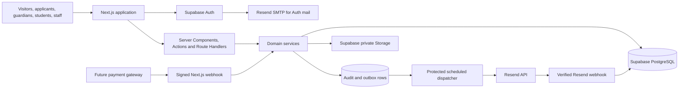

# Faiz Aam School Supabase Backend Blueprint

## 1. Summary and locked decisions

The frontend handoff and first backend foundation are complete enough for a controlled application cutover. The backend will use:

- Supabase PostgreSQL, Auth, and private Storage.
- A dedicated synthetic-data FASS staging project in `ap-south-1` (Mumbai).
- A separate FASS production project in the same region before launch.
- Resend SMTP for Supabase Auth emails.
- Resend API with React Email for school transactional emails.
- Vercel only after the backend and staging acceptance gates pass.
- One Next.js modular monolith; no second backend, microservices, Redis, GraphQL, Supabase Edge Functions, or Realtime dependency in v1.
- One database-backed outbox processed by a protected scheduled Next.js endpoint.

Current environment findings:

- `.env.example` contains names/placeholders only, including the server/browser adapter mirror; real values remain in `.env.local` or managed environments.
- The repository is linked to the dedicated `FAIZ E AAM` Supabase project, but the current environment could not re-verify its health/migration ledger because DNS/connection checks failed. Do not claim new migrations live until that check succeeds.
- Real secrets must never be placed in `.env.example`.
- Supabase CLI `2.111.0`, `@supabase/ssr@0.12.4`, and `@supabase/supabase-js@2.112.2` are pinned in the workspace.
- Pin Node.js 22 LTS for local, CI, and Vercel. Current Supabase packages have dropped Node 20 support, and recent Supabase changes also require explicit Data API exposure decisions. Review the [Supabase changelog](https://supabase.com/changelog) before every platform phase.

## Current execution checkpoint — C0–C5

## Active execution — three-portal consolidation (R0–P9)

The C5 staging sequence is **PAUSED** until the three-portal consolidation
lands and the local gates pass. The active execution order is:

- **R0 — repair/rebaseline.** Reconcile the canonical documents with the
  three-portal contracts (Administrator `/administrator/*`, Principal
  `/principal/*`, Guardian `/portal/*`), the two-profile migration redesign
  (`000042`), and the verified remote ledger facts.
  *Exit gate:* documentation rebaselined and the current tree reviewed.
- **Phase 3 — teaching records + result entry.** Add `teaching_assignments`
  (staff member, year, section, subject) independent of role grants; central
  result entry by the Principal profile's `result_entry_officer` with
  independent Administrator approval/publication and no self-approval.
  *Exit gate:* teaching assignments and central result entry pass local RLS/RPC
  and facade contract tests.
- **Phase 4 — imports.** School-first student/guardian import with audited
  batches and CSV-injection-safe handling.
  *Exit gate:* import round-trip, denial, and idempotency tests pass locally.
- **Phase 5 — guardian claims.** School-first invitations via mobile OTP
  (email fallback) bound to the exact guardian and approved link set; a student
  number, name, DOB, or phone alone never activates access.
  *Exit gate:* invitation binding, wrong-contact denial, and revocation tests
  pass locally.
- **Phase 6 — guardian portal.** Consolidate `/portal/*` on the imported
  guardian/link model.
  *Exit gate:* guardian journeys (including denial and revocation) pass
  locally.
- **Phase 7 — exports.** Scoped, audited exports with CSV-injection guards.
  *Exit gate:* export scope/denial/idempotency tests pass locally.
- **Phase 8 — full local gate.** Typecheck, lint, tests, build, scratch
  database suites, and the `000039` upgrade harness all green from the current
  checkout.
  *Exit gate:* every local gate passes on a clean run, including the upgrade
  harness.
- **Phase 9 — staging only after explicit approval.** Project
  classification/region/backup confirmed, dry-run first, reviewed commits only;
  produce a masked teacher-grant dependency inventory before any teacher-grant
  retirement; no Vercel/production work in this phase.
  *Exit gate:* explicit owner approval recorded, dry-run reviewed, and staging
  evidence collected — never a direct jump to production.

Each phase has a hard exit gate; no phase starts before the previous gate is
recorded as passed. The historical C0–C5 checkpoint text below is retained
unchanged for reference.

### C0 — verified locally

- Entry: the existing dirty frontend/backend working set is preserved and no new UI scope is introduced.
- Affected modules: QA dependencies/scripts, Next type generation, lint/build commands, database validator, and test fixtures.
- Playwright `1.62.1` and axe-core `4.13.0` are pinned; browser gates run without external `NODE_PATH` installations.
- `next typegen` runs before TypeScript; lint is zero-warning; the current build generates 76 routes.
- Current application gates: 394 web tests, 47 contract tests, 22/22 critical journeys, 54-route accessibility, focus smoke, 176 responsive pairs, 66-route/91-href link crawl, and the Supabase protected-path cutover guard.
- Scratch PostgreSQL applies migrations `000001–000030` and passes the RLS/RPC, release, operational, and provider-job suites.
- Tests: run typecheck, lint, unit/contract tests, build, browser journeys, accessibility, focus, responsive, link crawl, scratch migrations, RLS, and transactional RPC suites.
- Exit: all local gates are reproducible from the current checkout and the working tree is ready for review without applying migrations remotely.

### C1 — verified locally

- Entry: C0 local gates pass and the role/identity migration set is reviewed in the dirty worktree.
- Affected modules: `000020` role policies, `000017` invitation lifecycle, account suspension/reactivation, and `000021` private Storage bucket/policy setup.
- `000020_role_boundary_hardening.sql` removes system-administrator substitution for functional business roles while preserving access administration.
- Staff invitation role/scope storage and acceptance, account suspension, and reactivation are transactional and tested.
- `000021_private_storage_buckets.sql` creates private bucket/policy configuration when the Supabase Storage schema is present and safely skips it in the scratch validator.
- Tests: positive/negative RLS, pure system-administrator business denial, teacher finance denial, invitation expiry/reuse/wrong-contact/duplicate cases, atomic suspension, and reactivation without automatic re-grant.
- Exit: C1 is locally verified; remote migration-ledger verification remains a required gate before any staging apply.

### C2 — application facade cutover — VERIFIED LOCALLY

#### C2.0 — working-tree checkpoint

- Entry: C0/C1 local gates pass and the current dirty tree is inventoried.
- Affected modules: migrations/server domain code, facade adapters, UI fixes, tests, and documentation are reviewed as separate units; no unrelated dirty change may be folded into the slice.
- Work: group the current changes without resetting or overwriting them; record the exact local-only migration set and the remote-ledger blocker.
- Test: `git status`, `git diff --check`, typecheck, lint, unit tests, and scratch database suites.
- Exit: a reviewable checkpoint exists before any staging migration or global adapter switch.

#### C2.1 — identity, configuration, and context

- Entry: role-boundary migration and invitation lifecycle pass locally.
- Work: persist active staff workspace and active child selection; add academic-year/grade/section/subject/period/policy reads; complete staff invitation acceptance UI and account lifecycle; enforce applicant, guardian, staff, and TOTP route protection.
- Affected modules: identity, family context, staff context, users, school configuration, auth layouts, `/api/adapter`.
- Tests: Supabase-mode family/staff contract tests plus unauthenticated denial,
  `aal1` staff denial, `aal2` access, revoked grant, revoked guardian link,
  wrong workspace, wrong child, and context persistence.
- Local checkpoint: request-scoped selection cookies, server-seeded provider
  hydration, typed school-configuration reads, local staff invitation
  acceptance, adapter mismatch checks, and the denial contract suite are now
  implemented and verified without contacting a database. The staging/session
  proof in the exit condition remains pending.
- Exit: real Supabase sessions resolve one authorized family/staff context and never render demo identity data.

#### C2.2 — admissions → finance → enrollment — VERIFIED LOCALLY

- Entry: C2.1 context and ownership checks pass.
- Work: `000022_c2_admissions_enrollment_facade.sql`; transactional server draft upsert/versioning, authoritative readiness, create-or-match enrollment conversion, admissions/finance/enrollment domain mappers, applicant server draft references, offer/invoice/payment/retry branches, and guardian-link projection.
- Affected modules: `apps/web/modules/services/admissions.ts`, `finance.ts`, `enrollment.ts`, `lib/supabase/domain.ts`, `/api/adapter`, applicant autosave, and server loaders.
- Tests: cross-device draft, duplicate submit, requested changes/version history, offer retry, payment/invoice retry, conversion retry, wrong-owner denial, maker/checker, and link projection; scratch RLS/RPC from zero.
- Exit: verified locally. Staging/real-session proof remains pending; migrations `000016–000030` remain local-only.

#### C2.3 — results and timetable — VERIFIED LOCALLY

- Entry: enrollment and active assignment scopes are server-resolved.
- Work: `000023_c2_results_timetable_facade.sql`; result draft save/correction request+decision, immutable publication preservation, timetable revision/draft/validation/publication supersession, overrides, exam date-sheet commands, rich result/timetable reads, async timetable facade methods, and server loaders.
- Affected modules: `academics.ts`, `timetable.ts`, result/timetable adapter operations, portal/staff timetable reads, and result batch/detail mappers.
- Tests: exact class/subject scope, `aal1` denial, reviewer/publisher separation, stale draft, immutable publication/correction supersession, teacher/room hard conflict, override isolation, section-scoped portal propagation, and Supabase contract mappers; scratch validator assertions pass.
- Exit: verified locally. Staging/real-session proof remains pending.

#### C2.4 — remaining operational domains — VERIFIED LOCALLY

- Entry: C2.2 and C2.3 projections are authoritative and their contract tests pass.
- Affected modules: careers, content/notices, support, settings, audit, notifications/outbox, document projections, and all remaining portal/staff loaders.
- Work: `000024_c2_operational_facades.sql`; career drafts/withdrawal/version-safe HR decisions/reviewer assignment/scorecard/interview commands; immutable content draft/review/publish/unpublish; requester-safe support plus public intake/rate limiting/private notes/reopen/assign; optimistic settings save; read-only audit RPC; per-account notification list/mark projection; authorized document metadata (`clean`→`ready`); public support route and server loaders.
- Affected modules: careers/content/support/settings/audit/notifications/documents services, `/api/adapter`, `/api/support/public`, protected shells, and server loader projections.
- Tests: applicant ownership/withdrawal, cross-device recovery, content mapper and publisher denial, private-note denial, public intake denial/rate limit, notification/audit/settings projections, document scope, outbox retry/idempotency, static cutover guard; scratch validator applies all migrations and passes.
- Exit: verified locally. Provider scan/finalisation, Resend, staging sessions, and global adapter switch remain pending.

#### C2.5 — global adapter cutover — LOCAL GUARD VERIFIED; STAGING PENDING

- Entry: every protected facade has a server loader or `/api/adapter` branch, matching contract tests, and a projection refresh proof.
- Affected modules: runtime adapter registry, all protected route layouts/loaders, client context providers, session-storage helpers, and staging environment configuration.
- Work: remove operational demo/session state while retaining safe temporary form input and UI preferences; set both `FASS_DATA_ADAPTER` and `NEXT_PUBLIC_FASS_DATA_ADAPTER` to `supabase` only in staging.
- Tests: all real-session browser journeys, negative authorization tests, stale-version tests, cross-module parity checks, clean-checkout build, and `npm run check:cutover` for operational demo/session reads.
- Exit: staging is globally Supabase-backed and remains `VERIFIED`, not `RELEASED`; no protected request can silently fall back to demo data.

### C3 — private Storage and documents — PROVIDER-READY LOCALLY; STAGING PENDING

- Entry: C2.5 staging adapter gate passes for document metadata and generated-PDF commands.
- Affected modules: `storage.objects` buckets/policies, document upload-intent/finalisation/download routes, scan adapter, PDF worker, document projections, retention jobs, and signed URL delivery.
- Work: finish scan/finalisation and document-processing projections; enforce random object keys, checksum/type/size validation, scan states, retention class, and upload-before-ready ordering.
- Tests: private bucket policy, wrong guardian/student/staff scope, revoked link, expired signed URL, guessed object key, quarantined/failed scan, duplicate generation, and PDF readiness/retry.
- Exit: every authorized document upload/download and generated receipt/report path is recoverable, audited, signed, and backed by a ready/quarantined state in staging.

### C4 — Resend and outbox provider gate — PROVIDER-READY LOCALLY; CONFIGURATION PENDING

- Entry: C2.5 is globally Supabase-backed and C3 document notifications have stable event payloads.
- Affected modules: Resend SMTP/Auth, Resend API adapter/templates, signed webhook route, outbox worker/cron, suppression and delivery projections, invitation and notification services.
- Work: configure SMTP for Supabase Auth, verified sender domain, API key, webhook secret, and cron secret; add/verify invitation, application, payment, enrollment, results, timetable, link, and support templates without sensitive previews.
- Tests: duplicate `svix-id`, out-of-order events, bounce/complaint suppression, transient retry/backoff, permanent failure, cron authentication, recipient resolution, and idempotent outbox delivery.
- Exit: staging email delivery and suppression are `VERIFIED` with provider evidence; no sensitive marks, balances, documents, or applicant details appear in subjects/previews.

### C5 — staging, Vercel, and production — ACTIVE NEXT GATE

The next phase is environment activation and evidence collection, not feature
development. Complete the following stages in order. Never skip from a local
green gate directly to production.

#### C5 external prerequisites

| Input | Owner | Required before | Stop condition |
|---|---|---|---|
| Confirmed synthetic Supabase staging project and operator access | Supabase/project owner | C5.1 | Project identity, ownership, data classification, or ledger is uncertain |
| Node 22 runtime and pinned CLI/toolchain | Engineering owner | C5.0/C5.2 | Local/CI/staging use a materially different runtime |
| Approved staging URLs and domain/subdomains | School/domain owner | C5.3 | Auth redirects, webhook, or preview URL cannot be allowlisted |
| Private Storage ownership and scanner service | Storage/security owner | C5.4 | Scanner or retention/legal-hold policy is unapproved |
| CAPTCHA provider for anonymous support intake | Security/support owner | C5.3/C5.7 | Production-like public intake would use the local fake or bypass verification |
| Resend sender domain, SMTP/API ownership, and webhook access | Messaging owner | C5.5 | Sender/domain is unverified or secrets are unavailable |
| Cron secret and scheduler ownership | Operations owner | C5.5 | Worker cannot be invoked securely or monitored for freshness |
| School finance policy and merchant ownership | Finance owner | real gateway only | Provider, settlement, refunds, receipts, or reconciliation ownership is unapproved |
| Vercel team/project ownership and preview environment | Deployment owner | C5.9 | Project/account or environment-variable ownership is uncertain |
| Backup/restore target and responsible operator | Operations/data owner | C5.2/C5.8 | No recoverable pre-migration point or isolated rehearsal target exists |

Secrets are supplied through the relevant provider/Vercel/Supabase secret
manager. They are never written into this plan, chat, `.env.example`, logs,
screenshots, or browser-visible variables.

#### C5.0 — freeze, review, and source-control checkpoint

- **Entry:** local migrations `000001–000030`, tests, build, browser checks,
  provider contracts, and the cutover guard are green in `PROJECT-STATUS.md`.
- **Work:** inspect the complete dirty tree; separate migrations/database tests,
  application facades/loaders, provider/worker code, UI integration, and
  documentation into coherent review units. Review `.env.example`, generated
  assets, untracked files, and dependency changes. Do not commit `.env.local`,
  provider payloads, screenshots containing private data, or test secrets.
- **Required evidence:** reviewed diff summary, `git diff --check`, secret scan,
  lockfile review, local gate output, and commit IDs for the exact staging
  candidate.
- **Exit:** one reviewed commit or ordered commit series identifies the staging
  candidate. The working tree contains no unexplained application change.

#### C5.1 — confirm staging ownership and reconcile the migration ledger

- **Entry:** C5.0 passes; the linked project is confirmed as synthetic-data
  staging and the operator has explicit authority to inspect it.
- **Read-only first:** record the project reference, region, owner/team,
  environment label, Data API schemas, Auth URLs, Storage buckets, and backup
  capability. Run `npx supabase migration list --linked` and compare every
  local timestamp with `supabase_migrations.schema_migrations`.
- **Decision rules:** expect remote history through `000015` only. Stop if the
  project is production, contains non-fictional data, has unknown migrations,
  or the schema and ledger disagree. Do not run `migration repair` merely to
  make the table look aligned; it changes history only and requires a separate
  evidence-backed approval.
- **Required evidence:** saved ledger comparison, project ownership/region
  confirmation, synthetic-data confirmation, and a written apply/stop decision.
- **Exit:** migrations `000016–000030` are proven absent and safe to apply, or
  the phase is marked `BLOCKED` with the exact divergence.

#### C5.2 — apply staging migrations and regenerate database types

- **Entry:** C5.1 proves the ledger is aligned and a backup/restore point exists.
- **Preflight:** run `npx supabase db push --linked --dry-run`; review the exact
  ordered list and confirm no seed is included implicitly.
- **Apply:** one authorised operator runs `npx supabase db push --linked` once.
  Do not hand-create tables in Studio and do not use `--include-all` or
  `--include-seed` unless the ledger review explicitly requires it.
- **Verify:** re-run `npx supabase migration list --linked`; generate types with
  `npx supabase gen types --linked --lang typescript --schema public --schema app`
  into a temporary file, review the diff, then update
  `apps/web/lib/supabase/database.types.ts` deliberately.
- **Database gates:** run the fictional live integration suite, RLS positive and
  negative matrix, RPC/provider-job assertions, and Data API exposure checks.
  Run Supabase Security and Performance Advisors; triage every finding,
  especially exposed SECURITY DEFINER functions, RLS gaps, public buckets,
  sensitive columns, and unindexed foreign keys.
- **Required evidence:** before/after ledger, applied migration list, generated
  type diff, advisor export, database test output, and rollback/forward-fix note.
- **Exit:** staging database/schema is `VERIFIED`; application runtime is still
  not globally switched.

#### C5.3 — configure and verify Supabase Auth and real session boundaries

- **Entry:** C5.2 passes and staging uses fictional users only.
- **Configure:** approved site URL/redirect allowlist, email OTP/magic-link
  behavior, staff invitation redirect, recovery redirect, TOTP MFA, session/JWT
  policy, publishable/secret keys, and Resend SMTP for Auth mail. Keep anonymous
  staff signup impossible and existing-account OTP on `shouldCreateUser: false`.
- **Journeys:** applicant registration/verification/recovery; guardian sign-in
  and child switch; staff invite acceptance and AAL1→AAL2 TOTP; account
  suspension/reactivation; revoked grant; expired/used/revoked invite; revoked
  guardian link; wrong child, role, assignment, and workspace denial.
- **Required evidence:** fictional account references, sanitized Auth logs,
  route outcomes, AAL proof, and immediate access removal after revocation.
- **Exit:** identity and authorization are `VERIFIED` in staging. No other
  provider is inferred verified from Auth success.

#### C5.4 — activate private Storage, scanning, and generated PDFs

- **Entry:** C5.3 passes; private bucket ownership and scanner provider are
  approved.
- **Configure:** private `fass-private-documents` and
  `fass-generated-documents` buckets, `storage.objects` policies, scanner URL
  and secret, retention schedule, legal-hold behavior, and short signed-download
  lifetime. No bucket or object path becomes public.
- **Journeys:** admission and job upload intent→signed upload→server stat→scan;
  ready/quarantined/failed recovery; wrong owner/guardian/staff; revoked link;
  guessed path; expired signed URL; duplicate finalisation; orphan cleanup;
  receipt and report-card generation with upload-before-ready and duplicate-safe
  retry.
- **Required evidence:** bucket/policy export, scan events, checksum/type/size
  evidence, signed URL expiry, generated-document references, and retention job
  record. Never store file contents or signed URLs in documentation.
- **Exit:** private documents and generated PDFs are `VERIFIED` in staging.

#### C5.5 — activate Resend, webhook delivery, outbox, and cron

- **Entry:** C5.3 passes and the staging sender domain is verified.
- **Configure:** Resend API key, `EMAIL_FROM`, official Svix webhook secret and
  endpoint, `CRON_SECRET`, suppression policy, and Vercel/staging cron caller.
  Vercel Cron calls the configured path with HTTP GET; the endpoint must require
  `Authorization: Bearer <CRON_SECRET>`.
- **Journeys:** one fictional delivery for every retained template family;
  retry existing transient failures; HTTP 429/5xx backoff; permanent failure;
  duplicate `svix-id`; failed webhook replay; out-of-order delivered/bounced/
  complained events; suppression; in-app projection; worker concurrency and
  freshness.
- **Privacy checks:** subjects and previews contain no marks, balances, document
  contents, medical data, or full applicant details. Logs contain correlation
  references, never addresses, payloads, or secrets.
- **Required evidence:** provider message IDs, delivery rows, webhook receipts,
  suppression hashes, cron invocation, worker run/freshness, and safe log sample.
- **Exit:** Resend/outbox/cron is `VERIFIED` in staging.

#### C5.6 — finance policy gate and sandbox acceptance

- **Entry:** C5.3 passes; the school has not yet approved a real gateway.
- **Work:** keep the provider-neutral database sandbox visibly labelled. Verify
  invoice parity, reload-safe attempt recovery, exactly-once payment/receipt,
  concession/adjustment maker-checker, refund request/approval/posting, and
  reconciliation import/exception/resolve.
- **Decision boundary:** do not install Stripe or another gateway until merchant
  ownership, settlement account, fees, refund rules, webhook ownership, receipt
  numbering, and reconciliation responsibility are approved in writing.
- **Exit:** finance sandbox is `VERIFIED`; real payment remains `BLOCKED` unless
  a separate approved gateway implementation and live sandbox gate pass.

#### C5.7 — global staging adapter switch and vertical acceptance

- **Entry:** C5.2–C5.6 pass for every enabled provider.
- **Configure together:** set `FASS_DATA_ADAPTER=supabase` and
  `NEXT_PUBLIC_FASS_DATA_ADAPTER=supabase` in staging. A mismatch is a failed
  deployment. Demo remains available only in local/design environments.
- **Run end to end:** public content; applicant registration and both application
  types; admission→offer→invoice→payment→readiness→enrollment; guardian context,
  fees, receipts, documents, notices, support, results release/correction, and
  timetable/override/date sheet; all staff queues and maker-checker flows;
  notifications, audit, settings activation, Storage, PDF, and outbox.
- **Negative/recovery gate:** unauthenticated, AAL1, wrong role/scope/child,
  revoked grant/link, stale version, duplicate retry, provider outage,
  quarantined document, expired URL, and delayed job recovery.
- **Quality gate:** clean checkout, Node 22, migrations from zero, generated
  types with no unexplained diff, tests, typecheck, zero-warning lint, build,
  cutover guard, browser journeys, accessibility, focus, responsive sweep, link
  crawl, and `/api/health` with a fresh worker.
- **Exit:** staging is globally Supabase-backed and `VERIFIED`, never
  `RELEASED`.

#### C5.8 — backup and restore rehearsal

- **Entry:** C5.7 passes and the staging dataset remains fictional.
- **Work:** capture the approved database and Storage backup mechanism, restore
  into an isolated rehearsal target, verify migration history, row counts,
  private-object integrity, RLS, Auth linkage assumptions, and critical reads.
  Record RPO/RTO, responsible operator, and forward-fix procedure.
- **Exit:** a dated restore record proves the system can recover without making
  private objects public or silently losing append-only history.

#### C5.9 — Vercel preview against staging

- **Entry:** C5.7 and C5.8 pass; the repository candidate is committed.
- **Configure:** create/link the Vercel project with Node 22 and Preview-only
  staging variables. Mark server secrets sensitive. Confirm `vercel.json` cron,
  function runtime, Auth redirect URLs, webhook URL, and `/api/health`.
- **Build rule:** public Supabase variables are embedded at build time. Preview
  and production therefore use separate builds from the same reviewed commit;
  do not promote a staging-wired artifact into production.
- **Verify:** inspect deployment/build logs; run the complete staging browser
  and provider gate on the preview URL; check cron, webhook, safe logs, function
  timeouts, worker freshness, and no secret exposure in browser bundles.
- **Exit:** Vercel Preview is `VERIFIED` against staging. Production remains
  `NOT STARTED`.

#### C5.10 — production creation and release

- **Entry:** preview/staging is verified, school decisions are approved, and a
  release/rollback owner is named.
- **Work:** create a separate production Supabase project; apply `000001–000030`
  from zero; configure approved school data, Auth, private Storage/scanner,
  Resend, cron, domain, monitoring, backups, and—only if separately approved—a
  payment gateway. Build production from the same reviewed commit with
  production public variables.
- **Release gate:** repeat advisors, types, RLS/RPC/provider tests, real-session
  smoke journeys, health/worker checks, restore readiness, observability, and
  rollback/forward-fix review. Begin with controlled fictional/operator records
  before importing approved school data.
- **Exit:** mark production `RELEASED` only after deployment and post-deploy
  checks pass. A successful build or preview is not a release.

### C5 evidence register

For each C5 stage, add one dated entry to `PROJECT-STATUS.md` containing:

- environment and project/deployment identifier;
- reviewed commit and migration range;
- sanitized commands and test suites run;
- pass/fail counts and provider evidence references;
- advisor findings and disposition;
- backup/restore evidence;
- unresolved blockers and named owner;
- rollback or forward-fix decision.

Never paste credentials, tokens, raw Auth links, email addresses, signed Storage
URLs, provider payloads, or private school/student data into the evidence
register.

## 2. Target architecture



Runtime rules:

- Browser code uses Supabase only for authentication/session interaction when necessary.
- Protected business data is loaded through server components and domain services.
- Same-origin UI mutations use server actions.
- Webhooks, uploads/downloads, auth callbacks, and cron processing use route handlers.
- Domain services own transitions and business rules.
- Repositories own Supabase queries and never decide authorization.
- Multi-row business operations execute through narrow transactional PostgreSQL functions.
- Audit and outbox rows commit in the same transaction as the domain change.
- Provider calls happen outside locked database transactions.

## 3. Environment and secret strategy

### Required variables

`.env.example` contains names and obvious placeholders only:

```text
NEXT_PUBLIC_SUPABASE_URL=
NEXT_PUBLIC_SUPABASE_PUBLISHABLE_KEY=
SUPABASE_SECRET_KEY=
APP_URL=
RESEND_API_KEY=
RESEND_WEBHOOK_SECRET=
EMAIL_FROM=
CRON_SECRET=
DOCUMENT_SCANNER_URL=
DOCUMENT_SCANNER_SECRET=
FASS_DATA_ADAPTER=demo
NEXT_PUBLIC_FASS_DATA_ADAPTER=demo
```

Additional rules:

- Use new Supabase publishable and secret keys, not new legacy `anon` or `service_role` integrations. Publishable keys may be browser-visible; secret keys bypass RLS and remain server-only. [Supabase API-key guidance](https://supabase.com/docs/guides/getting-started/api-keys)
- `DATABASE_URL` is limited to migrations and controlled administrative scripts. The application runtime should normally use the Supabase clients and RPC layer.
- Store actual local values in `.env.local`.
- Store staging and production secrets in their respective Supabase, Resend, and Vercel secret managers.
- Create separate secret keys for application administration, migration/CI, and Resend SMTP where supported.
- Never prefix secret, database, Resend, webhook, cron, or payment credentials with `NEXT_PUBLIC_`.
- If a real secret is ever copied into `.env.example`, chat, screenshots, or logs, rotate it immediately.
- Preview deployments use the staging Supabase project and synthetic data.
- Production variables point only to the production project.
- Production migrations and Vercel deployment are blocked until version-controlled source is established, even though current local UI work continued without Git.

## 4. Authentication and account model

Use Supabase Auth with `@supabase/ssr` and per-request browser/server clients. The installed Next.js 15 convention must be used for session refresh; do not copy a Next.js 16 `proxy.ts` example without adapting it. Validate identity using `getClaims()` or a fresh `getUser()` call and never authorize from `getSession()` alone. [Supabase SSR guidance](https://supabase.com/docs/guides/auth/server-side/creating-a-client?framework=nextjs&package-manager=npm&queryGroups=framework&queryGroups=package-manager)

Authentication policy:

- Student-admission applicants: verified email OTP or magic link.
- Job applicants: verified email OTP or magic link.
- Guardians: invitation or verified email OTP/magic link.
- Staff: invite-only email/password first factor plus mandatory TOTP MFA.
- Staff routes, staff RPCs, and staff RLS policies require an `aal2` session.
- Student accounts remain disabled until the school approves the student-account policy.
- Anonymous signup never creates staff access.
- Auth `user_metadata` is display-only and never determines authorization.
- Roles, scopes, assignments, account status, and guardian links are read from database tables on every protected operation.
- Account suspension, role revocation, assignment expiry, or relationship revocation takes effect on the next server request even if the JWT is still valid.
- Auth, recovery, OTP, invitation, and link-request endpoints receive rate limits and generic known/unknown-account responses.

Supabase supports TOTP and represents a successfully verified second factor as `aal2`; enforce this in the server and database, not only in the UI. [Supabase MFA guidance](https://supabase.com/docs/guides/auth/auth-mfa)

## 5. Database conventions

Every domain table follows these rules:

- Internal primary key: UUID.
- Human reference: separate random, non-sequential reference such as `APP-2026-7K4M2Q`.
- Legally sequential receipt numbers, if required, are separate from route references.
- Timestamps: `timestamptz` in UTC.
- School display timezone: `Asia/Kolkata`.
- Money: signed `bigint` paise plus `currency = 'INR'`.
- Mutable operational records: positive integer `version`.
- Dates without time: PostgreSQL `date`.
- Status: text with explicit check constraints.
- Core relationships use foreign keys, not JSON.
- JSONB is limited to immutable form snapshots, safe event payloads, policy data, and normalized provider evidence.
- Index every foreign key.
- Queue indexes place equality fields first and time/cursor fields last.
- Large staff lists use cursor pagination on `(created_at, id)` or `(updated_at, id)`.
- Configuration records are archived, not hard-deleted.
- Applications, ledger rows, payment records, published result versions, audit rows, and provider events are never hard-deleted.
- Use `ON DELETE RESTRICT` for historical/financial/academic dependencies.
- External provider calls never happen while database row locks are held.

## 6. Canonical database modules

### Identity, people, and access

| Tables | Responsibility |
|---|---|
| `people` | Minimum human identity shared by guardian, student, applicant conversion, and staff records |
| `user_accounts` | Application account linked one-to-one to `auth.users.id`; status and safe verified contact |
| `role_definitions` | Seeded canonical role codes |
| `role_grants` | Account role, lifecycle, grantor, reason, effective dates, and version |
| `role_grant_academic_years` | Allowed academic-year scope |
| `role_grant_grade_sections` | Allowed class/section scope |
| `role_grant_subjects` | Allowed subject scope |
| `staff_members` | Staff identity and employment-access status |
| `staff_assignments` | Effective teacher/class/subject or operational assignment |
| `guardians` | Guardian domain identity |
| `students` | Permanent student identity |
| `guardian_student_links` | Verified many-to-many guardian/student relationship |
| `guardian_link_capabilities` | Academics, finance, documents, notices, and profile capabilities |
| `account_invitations` | Hashed one-time invitation reference, purpose, expiry, and state |
| `access_revalidation` | Incrementing account/relationship security version used to invalidate stale access |

Connections:

- `auth.users.id → user_accounts.id → people.id`.
- One person may be a guardian, staff member, or later student account holder without duplicating identities.
- A teacher needs an active account, role grant, staff member, and effective assignment.
- A guardian needs an active account, guardian record, active link, and required capability.
- System administrators manage grants/configuration but do not inherit functional approvals.

### School configuration

| Tables | Responsibility |
|---|---|
| `school_profile_versions` | Versioned official school identity and approved public data |
| `academic_years` | Upcoming/current/historical/closed school years |
| `grades` | Grade definitions |
| `grade_sections` | Academic-year-specific grade and section |
| `subjects` | Subject catalogue |
| `rooms` | Timetable rooms |
| `period_definitions` | Working-day and period configuration |
| `settings_versions` | Effective, versioned policy configuration |
| `feature_flags` | Controlled rollout flags, never authorization |

No school-policy value becomes effective while marked `policy_pending`.

### Student admissions

| Tables | Responsibility |
|---|---|
| `admission_windows` | Grade/year opening, closing, capacity, and policy reference |
| `admission_applications` | Owner, target year/grade, current status/version, and public reference |
| `admission_drafts` | Mutable authenticated draft with expiry |
| `admission_application_versions` | Immutable submitted/corrected form snapshots with schema version |
| `admission_reviews` | Officer review, visible reason, private note, and recommendation |
| `admission_assessments` | Approved assessment records |
| `admission_offers` | Grade/year, conditions, expiry, fee requirement, and response |
| `admission_events` | Applicant-safe and staff-private timeline events |
| `admission_documents` | Application-to-document relationship |
| `enrollment_conversions` | Idempotent application-to-student/enrollment/link result |

Connections:

- Draft belongs to the applicant account.
- Submission appends an immutable version.
- Requested changes create another version; they never overwrite the earlier submission.
- Accepting an offer requests exactly one admission invoice.
- Enrollment conversion references the accepted application, paid/waived invoice state, created/matched student, enrollment, and guardian links.

### Careers and job applications

| Tables | Responsibility |
|---|---|
| `job_vacancies` | Current vacancy state and public reference |
| `job_vacancy_versions` | Immutable published vacancy terms |
| `job_applications` | Applicant account, vacancy version, state, and reference |
| `job_application_versions` | Immutable submissions and corrections |
| `job_review_assignments` | Which HR reviewer/panel may access an application |
| `job_scorecards` | Internal reviewer scores |
| `job_interviews` | Interview scheduling and outcome |
| `job_events` | Applicant-safe and internal timeline events |
| `job_documents` | Application-to-private-document relationship |

An accepted offer does not create `staff_members`, `user_accounts`, role grants, or assignments. Onboarding and staff invitation are separate authorised commands.

### Students, guardians, and enrollment

| Tables | Responsibility |
|---|---|
| `students` | Stable permanent student record |
| `guardians` | Stable guardian record |
| `guardian_student_links` | Relationship, verification, capabilities, restrictions, and dates |
| `enrollments` | Student placement in academic year and grade/section |
| `enrollment_conversions` | Source application and idempotent conversion output |
| `student_support_records` | Optional restricted data, isolated from normal finance/teacher access |

`enrollments` is the central operational join:

- Finance targets student + enrollment + academic year.
- Result rosters derive from eligible enrollments.
- Timetable lookup derives grade/section from enrollment.
- Enrollment-targeted notices resolve through enrollment.
- Report cards and school documents attach to enrollment or an immutable publication.
- A student’s grade/section is never stored as a permanent field on the student identity row.

### Fees and payments

| Tables | Responsibility |
|---|---|
| `fee_schedule_versions` | Immutable approved fee schedule version |
| `fee_schedule_items` | Fee components and periods |
| `invoices` | Student/enrollment/year, schedule version, dates, status, and version |
| `invoice_items` | Immutable charged line items |
| `concessions` | Approved signed reductions |
| `ledger_entries` | Append-only signed charges, payments, concessions, adjustments, refunds, and write-offs |
| `payment_attempts` | Checkout attempt and provider-order state |
| `gateway_events` | Verified provider event identity, hash, normalized status, and processing outcome |
| `payments` | Confirmed captured payment |
| `payment_allocations` | Payment-to-invoice allocations |
| `receipts` | One receipt per qualifying posted payment |
| `refund_requests` | Maker request and approver state |
| `refunds` | Provider and ledger refund result |
| `reconciliation_runs` | Settlement comparison run |
| `reconciliation_exceptions` | Unmatched or conflicting provider/ledger records |

Financial invariants:

- Invoice balance is computed from ledger entries.
- Provider transaction ID, provider event ID, receipt number, and idempotency key are unique.
- Allocation cannot exceed payment availability or invoice balance.
- Confirmed refunds cannot exceed refundable payment balance.
- Browser redirects never mark an invoice paid.
- Signed, verified gateway evidence posts payment, allocation, receipt, audit, and outbox rows in one transaction.
- No raw card, UPI, bank, OTP, or gateway secret is stored.

The payment provider remains an adapter until the school selects an approved Indian gateway.

### Results and report cards

| Tables | Responsibility |
|---|---|
| `exam_definitions` | Year, term/exam, grade/section, and policy version |
| `assessment_components` | Subject components and maxima |
| `grade_band_versions` | Versioned grading configuration |
| `result_batches` | Class/section/subject/term workflow header |
| `result_rosters` | Frozen eligible enrollment/student roster |
| `result_batch_versions` | Immutable submitted, returned, approved, and correction versions |
| `mark_entries` | Student/component mark or explicit absent/status value |
| `result_publications` | Immutable publication header/version |
| `result_publication_items` | Exact per-student snapshot shown in the portal |
| `result_correction_requests` | Reason, maker/checker state, and source publication |
| `result_events` | Workflow and visibility-filtered timeline |

Connections:

- Teacher access requires exact assignment overlap with batch year, class, and subject.
- Moderator and publisher grants remain separate.
- Publication copies the approved batch into immutable per-student snapshots transactionally.
- The portal reads only `result_publication_items`.
- Correction creates a new batch/publication version and preserves the old one.

### Timetables and exam date sheets

| Tables | Responsibility |
|---|---|
| `timetable_versions` | Draft/published version, grade section, effective dates, and version |
| `timetable_periods` | Day/period, subject, teacher assignment, and room |
| `timetable_publications` | Effective immutable published timetable |
| `timetable_overrides` | Date-specific substitution, room change, cancellation, or special period |
| `exam_schedule_versions` | Versioned date-sheet header |
| `exam_schedule_entries` | Exam date/time, subject, room, and grade section |

Publication transaction:

1. Lock the draft version.
2. Verify expected version and manager grant.
3. Validate cohort, teacher, room, subject, duplicate-slot, and assignment conflicts.
4. Create the immutable publication.
5. Append audit and outbox rows.
6. Commit, then notify affected users asynchronously.

### Content, notices, and public pages

| Tables | Responsibility |
|---|---|
| `content_items` | Page/download/notice identity |
| `content_versions` | Immutable body, metadata, author, and review version |
| `notices` | Current notice workflow and timing |
| `notice_audiences` | Public, role, application, academic year, grade section, or student target |
| `content_documents` | Public-safe or protected content attachment |

Only published, active, public-audience content receives anonymous `SELECT` access. Drafts, scheduled items, recipient definitions, and protected attachments remain private.

### Documents and Supabase Storage

| Tables | Responsibility |
|---|---|
| `documents` | Object key, safe name, MIME, size, checksum, scan state, visibility, version, retention class |
| `admission_documents` | Admission attachment |
| `job_documents` | Job application attachment |
| `student_documents` | Student/enrollment attachment |
| `invoice_documents` | Receipt or finance attachment |
| `result_documents` | Report-card attachment |
| `support_documents` | Support attachment |
| `document_processing_events` | Upload, scan, quarantine, generation, and retention history |

Storage policy:

- Use private buckets such as `fass-private-documents` and `fass-generated-documents`.
- Object keys contain domain, opaque record ID, document ID, and random filename—never student names or emails.
- Upload begins by creating a pending metadata row.
- Server authorizes the owner and issues a short-lived signed upload operation.
- Validate actual content type, size, extension, and checksum.
- Mark uploaded objects `pending_scan`; do not expose them until the scan/generation adapter reports `ready`.
- Download resolves the metadata row, authorizes against its owning record, then returns a short-lived signed URL or streamed response.
- Upsert/overwrite is disabled for immutable applicant and generated documents.
- Supabase Storage requires explicit RLS policies; it denies uploads by default. [Supabase Storage access control](https://supabase.com/docs/guides/storage/security/access-control)

### Support, notifications, email, and operations

| Tables | Responsibility |
|---|---|
| `support_requests` | Requester, category, status, assignee, SLA, and version |
| `support_messages` | Requester-visible append-only thread |
| `support_private_notes` | Staff-only notes |
| `support_events` | Assignment/status timeline |
| `in_app_notifications` | Account-specific notification state |
| `notification_deliveries` | Event, recipient, channel, attempt, and provider state |
| `email_suppressions` | Hard-bounce, complaint, or manual suppression |
| `resend_webhook_events` | Unique `svix-id`, event time/type, and normalized payload |
| `outbox_events` | Pending/processing/delivered/failed asynchronous work |
| `audit_events` | Append-only safe actor/action/target/outcome evidence |
| `idempotency_records` | Operation key, request hash, authoritative result, and state |
| `rate_limit_buckets` | Hashed subject/action window counters |
| `job_runs` | Cron/maintenance job heartbeat and outcome |

## 7. Row-level security and database access

Enable and test RLS on every exposed table. `TO authenticated` alone is not authorization.

Policy matrix:

- Anonymous users: published public content, public notices, public vacancies, and approved public downloads only.
- Applicants: their own admission/job applications, versions, safe events, and documents.
- Guardians: students connected through active links and only capabilities granted on that link.
- Students: own records only when student accounts are enabled.
- Teachers: exact active year/class/section/subject assignments.
- Admissions staff: applications within assigned cycle/year and appropriate officer/approver action.
- Finance staff: finance rows in scope, with officer/approver maker-checker rules.
- Exam staff: reviewer or publisher action and batch scope.
- Timetable managers: timetable configuration scope only.
- HR: assigned vacancy/application panels.
- Support: requester-safe diagnostics and support records only.
- Auditors: safe read-only audit/reconciliation projections.
- System administrators: account/configuration operations, not business approvals.

Policy implementation:

- Use `(select auth.uid())` so identity is evaluated once per statement.
- Index all columns used by RLS helpers.
- Use `USING` and `WITH CHECK` for updates.
- Never authorize from `raw_user_meta_data`.
- Prefer `SECURITY INVOKER`.
- If a privileged helper is unavoidable, keep it in a private schema, fix `search_path = ''`, explicitly verify `auth.uid()`, role, scope, and MFA level, and revoke broad execution.
- Secret-key clients bypass RLS and therefore are limited to webhooks, outbox processing, Auth administration, and controlled maintenance.
- Run positive and negative tests for every policy and every role.

## 8. Transaction and synchronization contract

The following commit atomically:

- Application submission + immutable version + event + audit + outbox.
- Offer response + unique admission invoice request.
- Enrollment conversion + student match/create + enrollment + guardian links + invoice adoption + audit + outbox.
- Role/link grant or revocation + access-revalidation marker + audit + outbox.
- Invoice issue/adjustment + ledger entries + audit + outbox.
- Verified payment + allocation + receipt + audit + outbox.
- Result publication + per-student snapshots + audit + outbox.
- Timetable publication + periods/effective version + audit + outbox.
- Admissions, HR, content, and support decisions + visible timeline + audit/outbox.

Asynchronous work:

- Resend email.
- In-app notification recipient projection.
- PDF generation.
- File scan/quarantine.
- Scheduled notice delivery.
- Retention/anonymisation jobs.
- Reconciliation and non-authoritative reporting.

Outbox processing:

- Claim rows using `FOR UPDATE SKIP LOCKED`.
- Process bounded batches.
- Use exponential retry with `next_attempt_at`.
- Record attempts and last safe error.
- Move exhausted work to `failed` for staff review.
- Use a permanent database uniqueness constraint in addition to provider idempotency.
- Domain success is never rolled back because an email, PDF, or notification failed.

## 9. Resend connection

### Supabase Auth email

Configure each Supabase project with a separate Resend SMTP credential:

- Staging sender on a verified testing subdomain.
- Production sender on the verified school domain.
- Authentication templates: invite, magic link/OTP, recovery, email change, and security notifications.
- Callback URLs allow localhost and staging during development; production allows only the final domain.
- Auth links contain only token hashes and safe return routes.
- Supabase Auth SMTP and application-email API keys remain separate.

Resend documents the direct Supabase SMTP connection. [Resend Supabase SMTP guide](https://resend.com/docs/send-with-supabase-smtp)

### Application email

Use code-owned React Email templates for:

- Application submitted.
- Changes requested.
- Offer/waitlist/decline.
- Offer accepted and admission fee issued.
- Payment receipt available.
- Enrollment completed and guardian invitation.
- Job application status.
- Result publication/correction notice.
- Timetable/date-sheet publication.
- Link request approval/rejection.
- Support response.
- Security-sensitive account/grant change.

Rules:

- Email subjects and previews contain no marks, fee balances, medical details, or sensitive applicant information.
- Messages link to authenticated records.
- `notification_deliveries` has a unique `(event_id, recipient_account_id, channel, template_version)` constraint.
- Resend idempotency keys are derived from that record.
- The webhook endpoint verifies the signature before parsing trusted fields.
- Store `svix-id` uniquely because Resend webhooks are at-least-once and may arrive out of order.
- Bounce, complaint, and suppression events disable further non-essential email to the address.
- Delivery failure never changes the underlying application, payment, result, timetable, or support state. [Resend webhook guidance](https://resend.com/docs/webhooks/introduction)

## 10. Application interface and adapter strategy

Preserve the existing service contracts in `packages/contracts`.

Add:

- Supabase-generated database types under `apps/web/lib/supabase/database.types.ts`.
- Browser, server-user, and server-admin Supabase client factories.
- An authenticated actor resolver.
- RLS-aware repositories for each module.
- Server-only domain-service implementations.
- Transactional RPC wrappers for the commands in `design/BACKEND-HANDOFF-MATRIX.md`.
- A Resend adapter, Storage adapter, future payment adapter, and PDF/scan adapters.

Do not export generated database row types as public UI contracts. Repository rows are mapped into existing domain schemas.

Runtime switching:

```text
FASS_DATA_ADAPTER=demo | supabase
NEXT_PUBLIC_FASS_DATA_ADAPTER=demo | supabase
```

Rules:

- Demo remains available for isolated design/tests.
- Staging and production use `supabase`.
- Startup validation must reject mismatched server/public adapter values.
- Do not dual-write to demo and Supabase.
- Do not run different connected domains against different adapters in one runtime.
- Supabase adapter and demo adapter must pass the same contract test suite.
- Supabase mode must never silently fall back to demo records or operational
  session state.
- Server Components use direct server loaders or the server adapter boundary;
  Client Components use `/api/adapter`; protected pages never use an
  unauthenticated relative server fetch.
- Remove browser `sessionStorage` operational state after the global Supabase cutover, retaining only safe UI preferences and temporary unsent form state.

## 11. Historical backend implementation phases

The original B0–B8 roadmap below is retained as architectural history. The
active implementation order is C0–C5 in the current checkpoint above; it
overrides stale “not started” or “not applied” wording in the historical
sections.

### B0 — Supabase and migration foundation

- Establish version-controlled source before any production deployment.
- Upgrade and pin Node 22, Supabase CLI, Supabase JS, and SSR package versions.
- Create `fass-staging` in Mumbai with synthetic data only.
- Initialize `supabase/config.toml`, migrations, database tests, and deterministic seed files.
- Correct `.env.example`.
- Add Supabase client factories and environment validation.
- Create foundation tables: idempotency, audit, outbox, webhook receipts, rate limits, and job runs.
- Add database conventions, reference generation, version helpers, and base indexes.
- Generate database TypeScript types.
- Run security and performance advisors.

Exit: the complete schema can reset locally from migrations, seed synthetic data, generate types, and pass database tests without dashboard-only SQL.

### B1 — Auth, identity, roles, and school configuration

- Configure Supabase Auth and Resend SMTP in staging.
- Implement applicant/guardian magic-link or OTP flows.
- Implement invite-only staff accounts and mandatory TOTP.
- Persist people, accounts, guardians, students, staff, role grants, scopes, assignments, and school configuration.
- Replace demo staff and family context with server-resolved contexts.
- Implement RLS and server denial for all role/link/assignment cases.
- Implement grant/link revocation and access revalidation.

Exit: real staging accounts can sign in, switch valid workspaces/children, and are denied every invalid role, child, or assignment.

### B2 — Private documents, admissions, and careers persistence

- Create private buckets and document metadata.
- Implement authenticated draft save/resume.
- Persist immutable admissions and career application versions.
- Implement staff review assignments and maker/checker decisions.
- Connect applicant timelines to the same event records as staff views.
- Add document upload, pending scan, missing, quarantined, and ready states.
- Keep staff onboarding separate from job offer acceptance.

Exit: student and job applications survive browser/device changes, are private, versioned, scoped, and recoverable.

### B3 — Guardian links, students, and enrollment

- Persist guardian link requests and verification evidence.
- Implement approval, rejection, restriction, revocation, and capability changes.
- Implement active enrollment resolution.
- Implement duplicate-student review.
- Implement idempotent enrollment conversion transaction.
- Rebuild family context from active database records.
- Add invitation outbox event after conversion.

Exit: a converted student appears exactly once for the correct guardian; revocation ends access immediately without deleting history.

### B4 — Finance ledger and future gateway boundary

- Persist fee schedule versions, invoices, line items, ledger, attempts, payments, allocations, receipts, refunds, and reconciliation.
- Make portal and staff finance read the same database projections.
- Connect accepted admission offers to a unique admission invoice.
- Implement payment-attempt creation and a fake/sandbox adapter first.
- Implement signed webhook ingestion only after a payment gateway is selected.
- Add duplicate-event, amount mismatch, delayed, refund, and reconciliation recovery.
- Generate receipt metadata and enqueue PDF creation.

Exit: retries cannot duplicate invoice, payment, allocation, receipt, or refund; family and finance totals always agree.

### B5 — Results and timetable

- Derive result rosters from active enrollments.
- Persist exact teacher assignment scope.
- Implement teacher submission, moderator return/approval, publisher release, withdrawal, and correction.
- Publish immutable per-student result snapshots.
- Persist timetable drafts, conflicts, versions, publications, overrides, and date sheets.
- Resolve portal and teacher schedules from enrollment/assignment and effective date.

Exit: the full teacher-to-guardian result flow and timetable-manager-to-portal flow pass against staging PostgreSQL with wrong-scope denial.

### B6 — Content, notifications, support, users, settings, and audit

- Persist public pages, notices, audiences, support threads/private notes, users/grants, and effective settings.
- Complete the database outbox worker.
- Add React Email templates and Resend delivery.
- Add verified Resend webhook handling.
- Add PDF/document job states.
- Ensure every consequential action appends audit evidence.
- Add maintenance jobs for expired notices/offers, stuck outbox work, retention, and reconciliation.

Exit: one domain change reaches all intended consumers once and no unintended role/account/student.

### B7 — Global Supabase cutover

- Run all adapter contract tests against demo and Supabase.
- Switch staging globally to `FASS_DATA_ADAPTER=supabase`.
- Run all 22 existing browser journeys plus backend denial, persistence, stale-version, webhook, upload, email, and restore cases.
- Remove operational session-storage dependencies.
- Verify no protected route is statically generated with private data.
- Verify no secret appears in browser bundles, logs, screenshots, or build output.
- Update status documents from current evidence.

Exit: backend/database/auth/providers become `VERIFIED` in staging, not `RELEASED`.

### B8 — Vercel and production

- Create a separate `fass-production` Supabase project in Mumbai.
- Apply the same migrations from zero; never hand-create production tables.
- Configure production Auth URLs, staff MFA, Storage policies, Resend SMTP/API, webhook secrets, and sender domain.
- Import approved school configuration only; do not copy staging identities or fictional records.
- Configure Vercel preview to staging and production to production.
- Add the protected cron dispatcher and health endpoints.
- Apply backward-compatible migrations before deploying code that requires them.
- Deploy a Vercel preview, run E2E and provider checks, then promote the same verified artifact.
- Keep application rollback separate from database forward-fix migrations.
- Run post-deploy smoke, RLS denial, email, storage, outbox, and log checks.

Vercel production is not complete until post-deploy checks pass. [Vercel deployment guidance](https://vercel.com/docs/deployments)

## 12. Database and integration test plan

Required database tests:

- Every foreign key, check, uniqueness, and partial/composite index.
- RLS positive and negative cases for every actor type.
- Staff `aal1` denial and `aal2` acceptance.
- Revoked/expired role, assignment, enrollment, and guardian link.
- Wrong applicant, student, invoice, receipt, result, document, and support reference.
- Maker/checker self-approval denial.
- Immutable submitted application, ledger, result publication, and audit rows.
- Optimistic-version conflicts.
- Idempotency request hash mismatch.
- Concurrent application submit, invoice issue, payment callback, enrollment conversion, result publication, and outbox claim.
- Outbox `SKIP LOCKED` worker behavior.
- Cursor pagination and common staff queue query plans.
- Storage upload/download policy denial.
- Resend duplicate/out-of-order webhook delivery.
- Payment duplicate/mismatched webhook delivery once a gateway exists.

Required gates after every schema slice:

- Rebuild local database from migrations.
- Run database tests.
- Generate TypeScript types.
- Run Supabase security advisor.
- Run Supabase performance advisor.
- Run contract, unit, integration, and build gates.
- Confirm the affected frontend journey in the browser.

Final staging gate:

- Existing 22/22 critical journeys.
- Auth session expiry and recovery.
- Cross-device applicant draft resume.
- Guardian link approval/revocation.
- Wrong-child and wrong-assignment denial.
- Admission → invoice → payment → enrollment.
- Payment retry and reconciliation.
- Result maker/checker/publication/correction.
- Timetable conflict/publication/override.
- Private document denial and signed delivery.
- Email delivery, bounce, complaint, suppression, and retry.
- Database restore and post-restore finance/result integrity.

## 13. Backup, recovery, and operations

- Use automated Supabase database backups for production and approve PITR according to the school’s recovery requirement and budget.
- Run a restore rehearsal before launch.
- Maintain separate Storage-object backup/export because Supabase database backups contain Storage metadata but not the stored objects themselves. [Supabase backup guidance](https://supabase.com/docs/guides/platform/backups)
- Record recovery-point and recovery-time objectives.
- After restore, verify account access, guardian links, financial reconciliation, receipt uniqueness, result publications, document metadata/object parity, and outbox state.
- Alert on authentication abuse, failed webhook verification, payment mismatch, old processing attempts, outbox backlog, document failures, result publication failures, and database/storage capacity.
- Never log OTPs, auth tokens, magic links, secret keys, raw documents, full provider payloads, medical data, or complete student/contact records.

## 14. Explicit blockers and assumptions

- Supabase staging and production projects have not yet been created.
- The existing MyRental Supabase projects are excluded.
- The payment gateway and merchant account remain undecided; finance uses an adapter and sandbox until approved.
- The official school email domain and sender addresses remain pending.
- School decisions for admission policy, fees/refunds, result rules, timetable configuration, retention, and guardian verification remain policy-pending.
- No real student, guardian, applicant, job, financial, result, or document data enters staging.
- Facility/IoT remains isolated and receives no application tables in this project phase.
- Production deployment requires version-controlled source, reviewed migrations, approved policies, separate production credentials, and verified restore capability.
